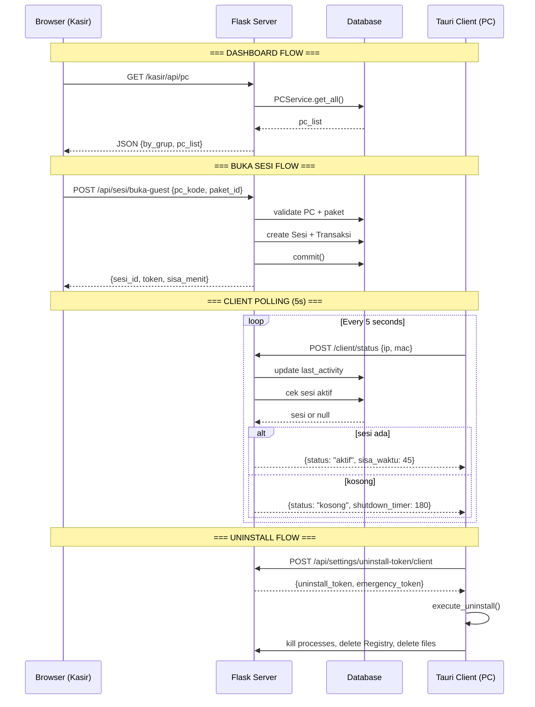
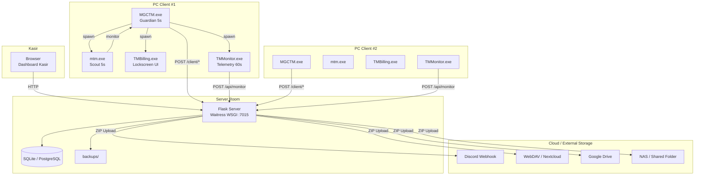
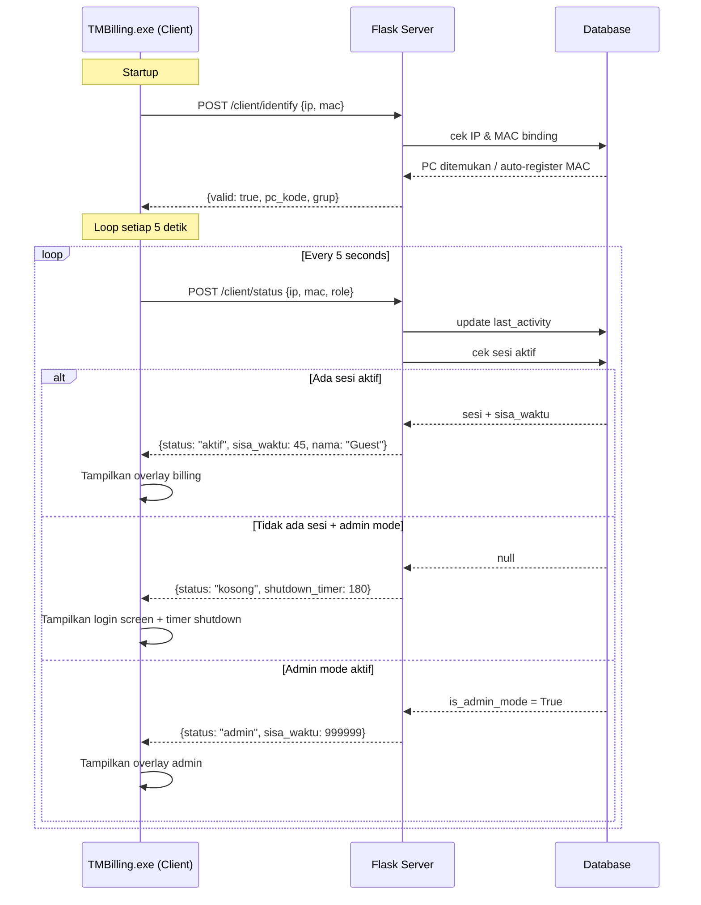
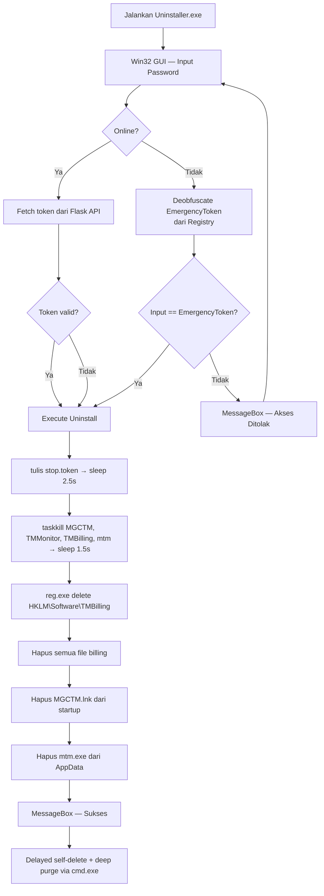
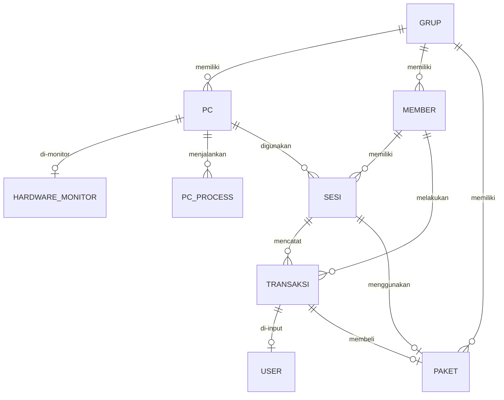

<!-- markdownlint-disable MD033 MD041 -->
<h1 align="center">🖥️ TMBilling</h1>

<p align="center">
  <strong>Sistem Manajemen Billing Warnet / Cybercafe Premium</strong>
  <br />
  Backend Flask · Frontend Vanilla JS · Client Tauri + Rust · Agent Rust
</p>

<p align="center">
  
  
  
  
  
  
</p>

<details>
  <summary><strong>📋 Daftar Isi</strong></summary>

- [📖 Tentang](#-tentang)
- [✨ Key Features](#-key-features)
- [🏗️ Arsitektur Sistem](#️-arsitektur-sistem)
- [📦 Struktur Repository](#-struktur-repository)
- [⚙️ Tech Stack](#️-tech-stack)
- [🚀 Quick Start — Server](#-quick-start--server)
- [💻 Quick Start — Client PC](#-quick-start--client-pc)
- [🔗 Client Polling & Data Flow](#-client-polling--data-flow)
- [🔐 Security System](#-security-system)
- [🛡️ Agent & Guardian System](#️-agent--guardian-system)
- [📊 Database Schema](#-database-schema)
- [🌐 API Endpoints](#-api-endpoints)
- [🎨 Frontend Dashboard](#-frontend-dashboard)
- [🛠️ Developer Guide](#️-developer-guide)
- [📚 Dokumentasi Lengkap](#-dokumentasi-lengkap)
- [🐛 Troubleshooting](#-troubleshooting)
- [📜 License](#-license)

</details>

---

## 📖 Tentang

**TMBilling** adalah sistem billing warnet/cybercafe berbasis web dengan arsitektur **3-layer** (Routes → Services → Repositories), dilengkapi **client lockscreen Tauri/Rust** di PC warnet, **watchdog multi-layer** (MGCTM + mtm), dan **monitoring hardware real-time**.

Sistem dirancang untuk:

- **Kasir** — Buka/tutup sesi, monitor PC grid real-time, cetak struk thermal 58mm
- **Member** — Login prepaid dengan saldo waktu, top-up via paket
- **Admin** — Manajemen PC, paket, grup, user, laporan, dan recovery blackout
- **Client PC** — Lockscreen kiosk, auto-login sesi aktif, polling tiap 5 detik, shutdown otomatis

---

## ✨ Key Features

<table>
  <tr>
    <td width="50%">
      <h4>🖥️ Dashboard Kasir Real-time</h4>
      <ul>
        <li>Grid PC dengan status warna (kosong/terpakai/admin/offline)</li>
        <li>Group tabs per zona (reguler, vip, vvip)</li>
        <li>Auto-refresh tiap 5 detik</li>
        <li>Buka sesi guest/member dalam 2 clicks</li>
      </ul>
    </td>
    <td width="50%">
      <h4>🔒 Client Lockscreen (Tauri)</h4>
      <ul>
        <li>Kiosk fullscreen — keyboard & mouse lock</li>
        <li>Low-level keyboard hook (WH_KEYBOARD_LL)</li>
        <li>Polling status tiap 5 detik</li>
        <li>Auto-login pas restart (guest & member)</li>
        <li>Shutdown timer otomatis</li>
        <li>Audio warning sisa 5 menit</li>
        <li>Native single-instance protection untuk mencegah multi-running window</li>
      </ul>
    </td>
  </tr>
  <tr>
    <td>
      <h4>📊 Monitoring Hardware</h4>
      <ul>
        <li>CPU/GPU temperature & usage real-time</li>
        <li>RAM, motherboard, NIC speed</li>
        <li>Active window detection</li>
        <li>Telemetry tiap 60 detik</li>
      </ul>
    </td>
    <td>
      <h4>⚡ Blackout Recovery</h4>
      <ul>
        <li>Auto-detect sesi mati lampu (heartbeat timeout)</li>
        <li>Resolve sesi member — refund sisa waktu</li>
        <li>Resolve sesi guest — pindah/tutup/lanjut</li>
      </ul>
    </td>
  </tr>
  <tr>
    <td>
      <h4>🛡️ Multi-Layer Watchdog</h4>
      <ul>
        <li>MGCTM — Master guardian loop 5-detik</li>
        <li>mtm — Anti-kill scout siluman</li>
        <li>Self-healing: MGCTM mati → mtm revive</li>
        <li>Hex-XOR obfuscation anti-regedit</li>
        <li>SHA256 integrity verification</li>
      </ul>
    </td>
    <td>
      <h4>📈 Cetak Struk Thermal 58mm</h4>
      <ul>
        <li>Print via iframe tersembunyi</li>
        <li>Format monospace untuk printer thermal</li>
        <li>Preview sebelum cetak</li>
      </ul>
    </td>
  </tr>
  <tr>
    <td>
      <h4>🔐 Emergency Offline Bypass</h4>
      <ul>
        <li>Client lockscreen — bypass dari Registry (diatur saat install)</li>
        <li>Uninstaller — offline fallback via EmergencyToken dari Registry</li>
        <li>Server override saat online (anti-cheat)</li>
      </ul>
    </td>
    <td>
      <h4>🔄 API Key Rotation Dinamis</h4>
      <ul>
        <li>Update API Key dari dashboard kasir</li>
        <li>Update instan ke .env + Flask config</li>
        <li>Tanpa restart server</li>
      </ul>
    </td>
  </tr>
  <tr>
    <td>
      <h4>☁️ Multi-Provider Cloud Backup</h4>
      <ul>
        <li>Kompresi database SQLite ke ZIP secara otomatis</li>
        <li>Upload simultan ke Discord, WebDAV, GDrive, dan NAS</li>
        <li>Auto-cleanup FIFO (menyimpan 5 file lokal & cloud)</li>
        <li>Test connection langsung dari dashboard kasir</li>
      </ul>
    </td>
    <td>
      <h4>🏆 Tournament Bracket Maker</h4>
      <ul>
        <li>Sistem kompetisi warnet terintegrasi</li>
        <li>Matchmaking otomatis Playoffs (Single Elimination)</li>
        <li>Sistem pairing Swiss Stage dengan scoring real-time</li>
        <li>Kemudahan update bracket & bagan pertandingan</li>
      </ul>
    </td>
  </tr>
  <tr>
    <td>
      <h4>💼 Shift Handover Kasir</h4>
      <ul>
        <li>Audit keuangan kasir dengan Blind Count (hitung buta)</li>
        <li>Auto-calculate deviasi pendapatan (Surplus/Defisit)</li>
        <li>Cetak struk pertanggungjawaban shift via printer thermal</li>
      </ul>
    </td>
    <td>
      <h4>🌐 Portal Web Member</h4>
      <ul>
        <li>Portal login mandiri pelanggan prepaid di <code>/member</code></li>
        <li>Informasi sisa saldo waktu & PC aktif secara real-time</li>
        <li>Riwayat login bermain & detail transaksi top-up</li>
      </ul>
    </td>
  </tr>
</table>

---

## 🏗️ Arsitektur Sistem

### 3-Layer Architecture (Strict SoC)

```
┌─────────────┐     ┌──────────────┐     ┌────────────────┐
│   Routes    │ ──> │  Services    │ ──> │  Repositories  │ ──> DB
│ (Endpoints) │     │ (Business)   │     │   (Queries)    │
└─────────────┘     └──────────────┘     └────────────────┘
       │                    │                     │
   Validasi           commit/rollback         add/delete
   Request            try/except              query only
       ↓                    ↓
   JSON Response      raise Exception
```

### End-to-End Data Flow



### System Topology



---

## 📦 Struktur Repository

```
TMBilling/
├── app/                                    # 🐍 Backend Flask
│   ├── __init__.py                         # Factory + blueprint registration
│   ├── config.py                           # Environment config
│   ├── models/                             # SQLAlchemy models (9 entities)
│   │   ├── base.py                         # db instance, now_local()
│   │   ├── pc.py                           # Unit komputer
│   │   ├── sesi.py                         # Session bermain
│   │   ├── transaksi.py                    # Transaksi keuangan
│   │   ├── member.py                       # Pelanggan prepaid
│   │   ├── paket.py                        # Paket billing
│   │   ├── grup.py                         # Zona kategori
│   │   ├── user.py                         # Staff kasir/admin
│   │   ├── hardware.py                     # Monitoring CPU/GPU/RAM
│   │   └── settings.py                     # Key-value config
│   ├── routes/                             # API endpoints (14 blueprints)
│   ├── services/                           # Business logic (16 services)
│   ├── repositories/                       # Data access layer (10 repos)
│   ├── templates/kasir/                    # Jinja2 templates
│   │   ├── login.html                      # Halaman login kasir
│   │   └── index.html                      # SPA dashboard
│   ├── static/js/kasir/                    # Frontend JS modules
│   │   ├── core/                           # API client, utils, toast, modal
│   │   ├── components/                     # Modal buka/tambah sesi
│   │   └── modules/                        # Per-tab modules (12 modules)
│   └── utils/                              # Logger, helpers
│
├── WarnetClient/                           # 💻 Client PC Warnet
│   ├── TMBillingTauri/                     # Main lockscreen (Tauri + Rust + HTML/JS/CSS)
│   │   ├── src/                            # HTML + JS frontend
│   │   │   ├── index.html                  # Lockscreen + overlay UI
│   │   │   ├── js/app.js                   # App controller, event listeners
│   │   │   ├── js/ui.js                    # DOM manipulation, timer, toast
│   │   │   └── js/api.js                   # Tauri invoke wrappers
│   │   └── src-tauri/src/                  # Rust backend
│   │       ├── main.rs                     # Setup, security, polling, hotkeys
│   │       ├── commands/                   # Tauri commands
│   │       │   ├── auth_commands.rs         # Login/logout/emergency
│   │       │   ├── window_commands.rs      # Kiosk/overlay switch
│   │       │   ├── network_commands.rs     # IP & MAC
│   │       │   └── system_commands.rs      # Shutdown, background
│   │       ├── utils/                      # Utilities
│   │       │   ├── api.rs                  # HTTP client + Hex-XOR
│   │       │   ├── keyboard.rs             # Low-level keyboard hook
│   │       │   └── window_manager.rs       # Taskbar control
│   │       ├── state.rs                    # Global state
│   │       └── models.rs                   # Data structs
│   └── TMMonitor/                          # Telemetry helper (C# - DEPRECATED)
│
├── WarnetAgent/                            # 🛡️ Agent & Guardian
│   ├── MGCTM/                              # Core launcher (Rust)
│   │   └── src/main.rs                     # 5s loop: spawn + sync + obfuscate
│   ├── mtm/                                # Anti-kill scout (Rust)
│   │   └── src/main.rs                     # Silent watchdog from AppData
│   ├── TMBilling_Monitor/                  # Hardware telemetry (Rust - TMMonitor.exe)

│   ├── TMBilling_Uninstaller/              # Uninstaller (Rust + Win32 GUI)
│   │   └── src/main.rs                     # Password GUI, offline fallback
│   └── Deploy/                             # 📦 Compiled binaries siap pakai
│       ├── MGCTM.exe
│       ├── TMBilling.exe
│       ├── TMMonitor.exe
│       ├── mtm.exe
│       ├── HardwareHelper.exe
│       ├── TMBilling_Uninstaller.exe
│       ├── install.bat                     # Auto installer
│       ├── write_config.ps1                # PowerShell config writer
│       ├── sync_registry.ps1               # Registry sync helper
│       └── create_admin_creds.ps1          # Password docs generator
│
├── docs/                                   # 📚 Dokumentasi
│   ├── CODEBASE_DOCUMENTATION.md           # Ringkasan semua komponen
│   ├── ARCHITECTURE.md                     # Arsitektur 3-layer, data flow
│   ├── BACKEND_GUIDE.md                    # Panduan backend
│   ├── FRONTEND_GUIDE.md                   # Panduan frontend & design system
│   ├── TECHNICAL_DOCS.md                   # API endpoint reference
│   ├── walkthrough.md                      # Implementasi Hex-XOR & watchdog
│   ├── UPGRADE_RUPIAH_AND_POS.md           # Dokumentasi format Rupiah & POS F&B
│   ├── NEW_FEATURES_GUIDE.md               # Panduan fitur baru (Turnamen, Member Portal, Shift)
│   └── agent.md                            # Agent task tracker
│
├── run.py                                  # 🔌 Entry point aplikasi server
├── seed.py                                 # 🌱 Data seeding script
├── requirements.txt                        # Python dependencies
├── .env.example                            # Environment template
└── README.md                               # Ini dia! 🎉
```

---

## ⚙️ Tech Stack

| Layer | Teknologi | Versi |
|-------|-----------|-------|
| **Backend** | Python + Flask + SQLAlchemy | 3.8+ / 3.0+ |
| **Frontend (Kasir)** | Vanilla JS (ES6 Modules) + Tailwind CSS CDN | - |
| **Database** | SQLite (development) / PostgreSQL / MySQL | - |
| **Client Lockscreen** | Tauri v1 + Rust + HTML/JS/CSS | 1.6+ / 1.75+ |
| **Agent (Guardian)** | Rust + WinAPI + winreg | 1.75+ |
| **Telemetry** | Rust + LibreHardwareMonitorLib | - |
| **WSGI Server** | Waitress (production) | - |
| **Scheduler** | APScheduler | - |
| **Font** | Inter (UI), JetBrains Mono (mono/angka) | - |

---

## 🚀 Quick Start — Server

### 📦 Setup Portable Server (Produksi Windows)

Jika Anda ingin mendistribusikan atau memasang server kasir TMBilling secara cepat di Windows OS tanpa perlu melakukan konfigurasi manual, Anda dapat menggunakan berkas batch otomatis:

1. **Ekstrak berkas `.zip`** aplikasi ke folder tujuan di komputer kasir.
2. **Jalankan `install.bat`** (klik ganda): Script akan membuat virtual environment `.venv` dan memasang seluruh dependensi otomatis. *(Membutuhkan koneksi internet pada pemasangan pertama)*.
3. **Konfigurasi berkas `.env`** di folder root jika diperlukan (untuk menyesuaikan port, database URL, dll).
4. **Jalankan `start.bat`** untuk menyalakan server kasir di latar belakang (*silent background mode* via `pythonw.exe`). Anda dapat langsung mengakses dashboard di browser Anda.
5. **Jalankan `stop.bat`** kapan saja untuk menghentikan server yang sedang berjalan di background secara aman.

> [!NOTE]  
> Jika database (`warnet.db`) masih kosong pada saat server pertama kali dijalankan, sistem secara otomatis akan membuatkan akun administrator default untuk login awal:
> * **Username:** `admin`
> * **Password:** `admin123`

---

### Prerequisites (Manual Setup)

- **Python 3.8+** — [Download](https://www.python.org/downloads/)
- **Git** — [Download](https://git-scm.com/downloads)

### 1. Clone

```bash
git clone https://github.com/milanalfandiismail/TMBilling.git
cd TMBilling
```

### 2. Virtual Environment

```bash
python -m venv .venv

# Windows
.venv\Scripts\activate

# Linux/macOS
source .venv/bin/activate
```

### 3. Install Dependencies

```bash
pip install -r requirements.txt
```

### 4. Configure Environment

```bash
# Copy template
copy .env.example .env
# or
cp .env.example .env
```

Edit `.env`:

```ini
SECRET_KEY=ubah-dengan-string-acak-panjang
DATABASE_URL=sqlite:///warnet.db
CLIENT_API_KEY=ubah-dengan-api-key-rahasia
DEBUG_MODE=False

WAITRESS_THREADS=8
AUTO_SHUTDOWN_MINUTES=3
POLLING_INTERVAL=5
BLACKOUT_THRESHOLD_MINUTES=1
```

### 5. Init Database + Seed Data

```bash
python seed.py
```

Script `seed.py` akan membuat:
- **3 Grup PC**: `reguler`, `vip`, `vvip`
- **3 PC**: PC-01, PC-02 (reguler), VIP-01 (vip)
- **3 Paket Billing**: 1 Jam (5.000), 3 Jam (12.000), Begadang VIP (25.000)
- **1 User Admin**: `admin` / `admin`

### 6. Run Server

#### Production Mode (Waitress WSGI — Recommended)

```bash
python run.py
```

Output:
```
🚀 [PRODUCTION] Menjalankan server TMBilling menggunakan WSGI Waitress...
🔗 [PRODUCTION] Alamat: http://0.0.0.0:7015
🧵 [PRODUCTION] Threads (Workers): 8
```

#### Development Mode (Flask Dev Server)

Set `DEBUG_MODE=True` di `.env`, lalu:

```bash
python run.py
```

### 7. Akses Dashboard

Buka browser: **`http://localhost:7015`**

```
Login: admin / admin
```

---

## 💻 Quick Start — Client PC

### Metode Instalasi Cepat (via Deploy Folder)

> [!TIP]
> Semua binary sudah pre-compiled di `WarnetAgent/Deploy/`. Kamu **tidak perlu** compile ulang!

```bash
# 1. Copy folder WarnetAgent/Deploy/ ke USB / jaringan lokal
# 2. Di PC client, klik kanan install.bat → Run as Administrator
# 3. Masukkan IP Server TMBilling saat diminta
# 4. Masukkan API Key server saat diminta
# 5. Masukkan Emergency Username & Password (offline bypass) — lihat catatan di bawah
# 6. Selesai! PC langsung terkunci + polling aktif
```

> [!IMPORTANT]
> **Emergency Credentials** (Username & Password untuk offline bypass) diatur manual oleh admin **saat instalasi**. Installer akan meminta input dengan default `TMBilling` / `TM123qaz!@#`.
> Kredensial ini disimpan di Registry `HKLM\Software\TMBilling` (Hex-XOR terobfuscate) dan digunakan untuk:
> - **Lockscreen offline**: Login darurat saat server mati
> - **Uninstaller offline fallback**: Verifikasi password tanpa koneksi server
> Password juga bisa diubah via Dashboard Kasir (Settings → Emergency Token).

Yang terjadi otomatis:
1. Membuat `C:\TMBILLING\` + copy semua binary
2. Setup Registry `HKLM\Software\TMBilling`
3. Buat startup shortcut `MGCTM.lnk` di `%ProgramData%\...\StartUp\`
4. Copy `mtm.exe` siluman ke `%APPDATA%\Microsoft\Protect\`
5. Hitung SHA256 hash → simpan di Registry
6. Start MGCTM.exe → spawn TMBilling.exe + TMMonitor.exe

### Uninstall

**Dua jalur autentikasi:**

1. **Online (via server)** — Dari Dashboard Kasir → Settings → copy **Uninstall Token**, lalu masukkan di Uninstaller. Cocok kalau jaringan normal.
2. **Offline (via Emergency Token)** — Masukkan **Emergency Password** yang sama dengan yang di-set saat instalasi (`install.bat`). Token dibaca dari Registry `HKLM\Software\TMBilling` (Hex-XOR). **Tidak perlu koneksi server.**

Langkah:
1. Jalankan `TMBilling_Uninstaller.exe` sebagai Administrator
2. Masukkan **Uninstall Token** (jika online) atau **Emergency Password** (jika offline)
3. Klik Uninstall → selesai — semua file + Registry + shortcut terhapus bersih

---

## 🔗 Client Polling & Data Flow

### Polling Loop (5 detik)



### Auto-Login Behavior

| Skenario | Saat Restart PC |
|----------|----------------|
| **Guest** lagi main | ✅ Auto-login — sesi masih ada di DB |
| **Member** lagi main | ✅ Auto-login — sesi masih ada di DB |
| **Admin** lagi akses | ❌ Tidak auto-login — polling paksa logout |
| **Emergency** aktif | ❌ Emergency mode hilang setelah restart |

### Status Response Reference

**Sesi Aktif:**
```json
{
  "status": "aktif",
  "sisa_waktu": 45,
  "nama": "Guest2401",
  "grup": "tm",
  "pc_kode": "PC-01",
  "shutdown_timer": 0
}
```

**Kosong (dengan shutdown timer):**
```json
{
  "status": "kosong",
  "pc_kode": "PC-01",
  "shutdown_timer": 180
}
```

**Remote Force Lock dari Kasir:**
```json
{
  "status": "kosong",
  "pc_kode": "PC-01",
  "command": "lock"
}
```

---

## 🔐 Security System

### 1. Hex-XOR Obfuscation

Semua data sensitif disimpan **ter-obfuscate** di Registry dan config.ini — tidak bisa dibaca mentah via `regedit.exe`.

```
Algoritma: Plaintext → XOR(key) → Hex encode → Storage
Storage → Hex decode → XOR(key) → Plaintext

Kunci: "TMBillingSecretKey2026SecureObfuscation"
```

Yang di-obfuscate:
| Data | Lokasi |
|------|--------|
| `ApiKey` | Registry `HKLM\Software\TMBilling` |
| `EmergencyUser` | Registry `HKLM\Software\TMBilling` |
| `EmergencyToken` | Registry `HKLM\Software\TMBilling` |
| `ApiKey` | `C:\TMBILLING\config.ini` |
| `EmergencyUser` | `C:\TMBILLING\config.ini` |
| `EmergencyToken` | `C:\TMBILLING\config.ini` |

Setiap 5 detik, watchdog **auto-scramble** jika ada konfigurasi plain-text baru.

### 2. SHA256 Integrity Verification

Setiap binary punya hash SHA256 yang disimpan di Registry:

| Registry Key | Binary |
|--------------|--------|
| `Hash_MGCTM` | MGCTM.exe |
| `Hash_TMBilling` | TMBilling.exe |
| `Hash_TMMonitor` | TMMonitor.exe |
| `Hash_mtm` | mtm.exe |
| `Hash_Uninstaller` | TMBilling_Uninstaller.exe |

Hash diverifikasi saat startup (release build). Jika file diubah/modifikasi → **exit immediately**.

### 3. File Lock

```rust
OpenOptions::new()
    .read(true)
    .share_mode(0x00000001) // FILE_SHARE_READ only
    .open(&exe_path)
```

Semua binary membuka handle ke dirinya sendiri dengan akses eksklusif — mencegah rename/hapus saat running.

### 4. Process Name Verification

Setiap binary release memverifikasi nama prosesnya sendiri:

```rust
if exe_name != "MGCTM.exe" { exit(1); }
```

Cegah rename attack.

### 5. API Key Rotation

Admin kasir bisa mengubah API Key kapan saja dari dashboard → Settings:

```
PUT /api/settings/apikey
→ Update .env file
→ Update Flask config in-memory
→ Agent sync otomatis setiap 5 detik
→ Tanpa restart server!
```

### 6. Client Authentication

| Metode | Mekanisme | Auth Paths |
|--------|-----------|-----------|
| **Kasir Dashboard** | Flask session cookie + `login_required` decorator | Online only |
| **Client → Server** | `X-Client-Key` header + IP & MAC binding | Online only |
| **Admin (dari client)** | Dua jalur: **(1)** Cek Emergency User + Emergency Token lokal dulu (offline), **(2)** jika bukan emergency → `POST /client/admin-login` ke Flask API | **Offline**: Emergency bypass dari Registry / **Online**: API ke server |
| **Uninstaller** | Dua jalur: **(1)** `Uninstall Token` dari `GET /api/settings/uninstall-token/client` (online), **(2)** `Emergency Token` dari Registry via Hex-XOR deobfuscate (offline fallback) | **Online**: fetch token via API / **Offline**: deobfuscate EmergencyToken |
| **Emergency Default** | `TMBilling` / `TM123qaz!@#` (diatur saat instalasi oleh `install.bat`, bisa diubah via Dashboard atau ulang instalasi) | - |

---

## 🛡️ Agent & Guardian System

### Component Matrix

| Agent | Process | Location | Role |
|-------|---------|----------|------|
| **MGCTM** | `MGCTM.exe` | `C:\TMBILLING\` | Master guardian — spawn & monitor semua komponen |
| **TMMonitor** | `TMMonitor.exe` | `C:\TMBILLING\` | Telemetry helper — kirim hardware data tiap 60s |
| **TMBilling** | `TMBilling.exe` | `C:\TMBILLING\` | Tauri lockscreen — main UI |
| **mtm** | `mtm.exe` | `%APPDATA%\Microsoft\Protect\` | Anti-kill scout — revive MGCTM |
| **Uninstaller** | `TMBilling_Uninstaller.exe` | `C:\TMBILLING\` | Uninstall with offline fallback |

### MGCTM — Master Guardian Loop

```rust
loop {
    // 1. Cek apakah uninstaller minta shutdown
    if check_stop_token() { break; }

    // 2. Sync token dari server (untuk uninstall)
    sync_uninstall_token();

    // 3. Spawn TMBilling.exe jika mati
    if !is_process_running("TMBilling.exe") { spawn("TMBilling.exe"); }

    // 4. Spawn TMMonitor.exe jika mati
    if !is_process_running("TMMonitor.exe") { spawn("TMMonitor.exe"); }

    // 5. Spawn mtm.exe dari AppData jika mati
    if !is_process_running("mtm.exe") { spawn_from_appdata("mtm.exe"); }

    // 6. Sinkron & obfuscate Registry
    load_config();  // auto-obfuscate jika ada plain-text

    // 7. Loop 5 detik
    sleep(5);
}
```

### mtm — Anti-Kill Scout

```rust
loop {
    // Cek stop.token (shutdown legal)
    if check_legal_shutdown() { break; }

    // Cek MGCTM via WinAPI (CreateToolhelp32Snapshot)
    if !is_process_running("MGCTM.exe") {
        spawn("C:\\TMBILLING\\MGCTM.exe");
    }

    sleep(5);
}
```

> [!WARNING]
> mtm.exe berjalan dari `%APPDATA%\Microsoft\Protect\` — lokasi siluman yang jarang diperiksa admin. Ini adalah **last resort** untuk memastikan sistem tetap berjalan.

### Uninstaller Flow



---

## 📊 Database Schema

### Entity Relationship



### Key Tables

**`pc`** — Unit komputer
| Field | Type | Description |
|-------|------|-------------|
| `id` | PK | Auto increment |
| `kode` | String (unique) | Nama PC, e.g. PC-01 |
| `ip_address` | String | IP binding |
| `mac_address` | String | MAC binding (auto-register) |
| `grup_id` | FK → grup | Zona PC |
| `is_admin_mode` | Bool | Status admin mode |
| `last_activity` | DateTime | Last polling timestamp |

**`sesi`** — Session bermain
| Field | Type | Description |
|-------|------|-------------|
| `id` | PK | Auto increment |
| `tipe` | Enum | `guest`, `member`, `admin` |
| `pc_id` | FK → pc | PC yang digunakan |
| `member_id` | FK → member (nullable) | Member (if tipe=member) |
| `durasi_beli_menit` | Int | Durasi awal (guest) |
| `waktu_mulai_sesi` | DateTime | Session start time |
| `status` | Enum | `aktif`, `selesai` |
| `is_admin` | Bool | Admin flag |
| `is_blackout_suspect` | Bool | Blackout suspect flag |
| `is_blackout_resolved` | Bool | Blackout resolved flag |

**`transaksi`** — Catatan keuangan
| Field | Type | Description |
|-------|------|-------------|
| `id` | PK | Auto increment |
| `no_nota` | String (unique) | Format: `TM-YYYYMMDD-NNN` |
| `jenis` | Enum | `beli_paket_guest`, `tambah_waktu_guest`, etc. |
| `jumlah` | Integer | Harga |
| `menit` | Integer | Durasi |
| `sesi_id` | FK → sesi | Session reference |
| `member_id` | FK → member | Member reference |
| `user_id` | FK → user | Kasir reference |

---

## 🌐 API Endpoints

### Kasir Auth
| Method | Endpoint | Auth | Description |
|--------|----------|------|-------------|
| POST | `/api/kasir/login` | None | Login kasir/admin |
| POST | `/api/kasir/logout` | Session | Logout |
| GET | `/api/kasir/check` | None | Check session |

### Client (Tauri/Agent)
| Method | Endpoint | Auth | Description |
|--------|----------|------|-------------|
| POST | `/client/identify` | API Key + IP/MAC | Registrasi PC |
| POST | `/client/status` | API Key + IP/MAC | Polling status (5s) |
| POST | `/client/selesai` | API Key + IP/MAC | Logout dari client |
| POST | `/client/admin-login` | API Key + IP/MAC | Admin bypass from client |
| POST | `/client/emergency-login` | API Key + IP/MAC | Emergency login |
| GET | `/api/settings/uninstall-token/client` | API Key | Uninstall token |

### Session
| Method | Endpoint | Auth | Description |
|--------|----------|------|-------------|
| POST | `/api/sesi/buka-guest` | Session | Buka sesi guest |
| POST | `/api/sesi/buka-member` | Session | Buka sesi member |
| POST | `/api/sesi/tutup/{id}` | Session | Tutup sesi |
| POST | `/api/sesi/pindah-pc/{id}` | Session | Pindah PC |
| POST | `/api/sesi/tambah-waktu-sesi/{id}` | Session | Tambah durasi |
| GET | `/api/sesi/sesi/{id}` | Session | Detail sesi |

### Master Data
| Method | Endpoint | Auth | Description |
|--------|----------|------|-------------|
| GET/POST | `/api/pc` | Session | List/tambah PC |
| PUT/DELETE | `/api/pc/{id}` | Session | Edit/hapus PC |
| POST | `/api/pc/batch` | Session | Batch registration |
| GET/POST | `/api/member` | Session | List/tambah member |
| PUT/DELETE | `/api/member/{id}` | Session | Edit/hapus member |
| GET/POST | `/api/paket/` | Session | List/tambah paket |
| PUT/DELETE | `/api/paket/{id}` | Session | Edit/hapus paket |
| GET/POST | `/api/grup/` | Session | List/tambah grup |

### Report
| Method | Endpoint | Auth | Description |
|--------|----------|------|-------------|
| GET | `/api/report/laporan-harian` | Session | Summary hari ini |
| GET | `/api/report/laporan?tanggal=` | Session | Detail per tanggal |
| GET | `/api/report/struk/{id}` | Session | Data struk |
| GET | `/api/report/log` | Session | System logs |
| GET | `/api/report/log/export` | Session | Download log (.txt) |

### Hardware Monitor
| Method | Endpoint | Auth | Description |
|--------|----------|------|-------------|
| GET | `/api/monitor/all` | Session | Semua data hardware |
| POST | `/api/monitor` | API Key | Telemetry from client |
| GET | `/api/monitor/processes/{pc_id}` | Session | Proses PC |

### Blackout
| Method | Endpoint | Auth | Description |
|--------|----------|------|-------------|
| POST | `/api/blackout/deteksi` | Session | Detect blackout sessions |
| GET | `/api/blackout/list` | Session | List blackout |
| POST | `/api/blackout/resolve/member/{id}` | Session | Refund member |
| POST | `/api/blackout/resolve/guest/lanjut/{id}` | Session | Guest pindah PC |

### Settings & User
| Method | Endpoint | Auth | Description |
|--------|----------|------|-------------|
| GET | `/api/settings/settings` | Session | All settings |
| PUT | `/api/settings/auto-shutdown` | Session | Update shutdown timer |
| PUT | `/api/settings/apikey` | Admin | Rotate API Key |
| POST | `/api/settings/backup/manual` | Admin | Trigger manual backup |
| GET/POST | `/api/user/` | Admin | CRUD staff |

---

## 🎨 Frontend Dashboard

### Design System — Pristine Dark

| Token | Tailwind Class | Hex Value |
|-------|---------------|-----------|
| Background | `bg-slate-950` | `#020617` |
| Card | `bg-slate-900 border-slate-800` | `#0f172a` |
| Input | `bg-slate-800 border-slate-700` | `#1e293b` |
| Primary | `indigo-600` | `#4f46e5` |
| Success | `emerald-600` | `#059669` |
| Danger | `red-600` | `#dc2626` |
| Font UI | Inter (sans-serif) | - |
| Font Mono | JetBrains Mono | - |

### Module Structure

```javascript
app/static/js/kasir/
├── core/
│   ├── api.js        // Fetch wrapper + CSRF + credentials
│   ├── utils.js      // formatRupiah(), formatMenit(), escapeHtml()
│   ├── toast.js      // Toast notification
│   └── modal.js      // Dynamic modal + confirm dialog
├── components/
│   ├── modal-buka.js   // "Buka Sesi" dialog
│   └── modal-tambah.js // "Tambah Waktu" dialog
└── modules/
    ├── dashboard.js  // PC Grid + real-time refresh
    ├── member.js     // Member CRUD
    ├── paket.js      // Paket CRUD
    ├── pc.js         // PC CRUD + batch
    ├── grup.js       // Grup CRUD
    ├── laporan.js    // Reports
    ├── log.js        // System logs
    ├── struk.js      // Receipts + print
    ├── monitor.js    // Hardware monitoring
    ├── blackout.js   // Blackout recovery
    ├── user.js       // Staff management
    └── settings.js   // App settings
```

---

## 🛠️ Developer Guide

### Prerequisites for Development

| Tool | Minimum Version | Download |
|------|----------------|----------|
| Python | 3.8+ | [python.org](https://python.org) |
| Rust | 1.75+ | [rustup.rs](https://rustup.rs) |
| Node.js | 18+ | [nodejs.org](https://nodejs.org) |
| Git | Latest | [git-scm.com](https://git-scm.com) |

### Backend Development

```bash
# Setup
cd TMBilling
python -m venv .venv
.venv\Scripts\activate   # or source .venv/bin/activate
pip install -r requirements.txt

# Config
copy .env.example .env  # Edit CLIENT_API_KEY
python seed.py

# Run dev mode (set DEBUG_MODE=True in .env)
python run.py
```

### Tauri Client Development

```bash
cd WarnetClient/TMBillingTauri

# Install JS dependencies
npm install

# Set Server URL (edit config.ini)
# src-tauri/config.ini
# [TMBilling]
# url=http://192.168.1.100:7015
# apikey=TM2026QWERTY-api-key

# Run in dev mode (with hot reload)
npm run tauri dev

# Build for production
npm run tauri build  # -> src-tauri/target/release/TMBilling.exe
```

### Kompilasi Agen & Client (Unified Build & Deploy)

Untuk mempermudah dan mengompilasi seluruh agen sekaligus serta menyalinnya ke folder Deploy, gunakan script batch yang telah disediakan:

```bash
# Jalankan dari root folder
build_and_deploy.bat
```

Atau kompilasi secara manual per proyek:

```bash
# MGCTM — Master Guardian
cd WarnetAgent/MGCTM
cargo build --release
# -> target/release/MGCTM.exe

# mtm — Anti-kill scout
cd WarnetAgent/mtm
cargo build --release
# -> target/release/mtm.exe

# TMMonitor — Telemetry
cd WarnetAgent/TMBilling_Monitor
cargo build --release
# -> target/release/TMMonitor.exe

# Uninstaller
cd WarnetAgent/TMBilling_Uninstaller
cargo build --release
# -> target/release/TMBilling_Uninstaller.exe
```


### Compiling C# Telemetry Helper

```bash
cd WarnetAgent/TMBilling_Monitor
# Using .NET Framework 4.8 compiler
C:\Windows\Microsoft.NET\Framework64\v4.0.30319\csc.exe /target:exe /out:HardwareHelper.exe /reference:LibreHardwareMonitorLib.dll HardwareHelper.cs
```

### Adding New Feature — Workflow

```
1. MODEL     → app/models/               → definisi tabel
2. REPO      → app/repositories/         → query CRUD
3. SERVICE   → app/services/             → business logic
4. ROUTES    → app/routes/               → endpoint API
5. BLUEPRINT → app/__init__.py           → register blueprint
6. FRONTEND  → app/static/js/kasir/      → module JS
```

### Database Migrations

```bash
flask db migrate -m "deskripsi perubahan"
flask db upgrade       # Apply
flask db downgrade     # Rollback (1 step)
```

Atau untuk development: cukup restart server — `db.create_all()` otomatis bikin tabel baru.

### Scheduler Tasks (run.py)

| Task | Interval | Description |
|------|----------|-------------|
| `cleanup_expired` | 1 menit | Tutup sesi yang waktu habis |
| `database_backup` | 60 menit | Kompresi database SQLite ke ZIP, simpan lokal di `backups/`, dan upload otomatis ke cloud provider aktif (Discord, WebDAV, GDrive, NAS) dengan cleanup FIFO (maksimal 5 berkas terbaru) |

---

## 📚 Dokumentasi Lengkap

| File | Isi |
|------|-----|
| [docs/CODEBASE_DOCUMENTATION.md](docs/CODEBASE_DOCUMENTATION.md) | 📘 Ringkasan semua komponen (start here!) |
| [docs/ARCHITECTURE.md](docs/ARCHITECTURE.md) | 🏗️ Arsitektur 3-layer, data flow diagrams |
| [docs/BACKEND_GUIDE.md](docs/BACKEND_GUIDE.md) | 🐍 Panduan backend, coding patterns, error handling |
| [docs/FRONTEND_GUIDE.md](docs/FRONTEND_GUIDE.md) | 🎨 JS modular, design tokens, UI components |
| [docs/TECHNICAL_DOCS.md](docs/TECHNICAL_DOCS.md) | 🌐 API endpoint reference (lengkap req/res) |
| [docs/walkthrough.md](docs/walkthrough.md) | 🛡️ Walkthrough Hex-XOR, watchdog, offline uninstall |
| [docs/CLOUD_BACKUP_DESIGN.md](docs/CLOUD_BACKUP_DESIGN.md) | ☁️ Rencana Desain: Sistem Backup Multi-Provider TMBilling |
| [docs/NEW_FEATURES_GUIDE.md](docs/NEW_FEATURES_GUIDE.md) | 🚀 Panduan fitur baru (Tauri Single-Instance, Portal Member, Turnamen, & Shift) |
| [docs/UPGRADE_RUPIAH_AND_POS.md](docs/UPGRADE_RUPIAH_AND_POS.md) | 🪙 Pembaruan format Rupiah, layout mobile & POS F&B |
| [docs/agent.md](docs/agent.md) | 📋 Agent task tracker |

---

## 🐛 Troubleshooting

### Database Error — Table Not Found
```bash
python seed.py  # Re-init database
```

### Client Cannot Connect to Server
- Verifikasi IP Server di `C:\TMBILLING\config.ini`
- Cek firewall — port 7015 harus terbuka
- Cek API Key — harus sama dengan `.env` server
- Restart MGCTM.exe (atau restart PC)

### Registry Error — Access Denied
- Pastikan process running as **Administrator**
- Untuk install/uninstall — **Run as Administrator**

### Watchdog Not Running
```powershell
# Cek process
tasklist /FI "IMAGENAME eq MGCTM.exe"
tasklist /FI "IMAGENAME eq mtm.exe"

# Force restart
taskkill /F /IM MGCTM.exe /IM mtm.exe
C:\TMBILLING\MGCTM.exe
```

### "Force Locked" — Client Terus Lock
- Kasir belum buka sesi — polling dapet `status: "kosong"`
- Admin mode expired — login ulang via Ctrl+Alt+A
- Server override admin lock — kasir matikan admin mode

### Lupa Uninstall Token atau Server Mati?
Gunakan **Emergency Mode Offline**:
1. Buka Dashboard Kasir → **Settings** → catat **Emergency Token** yg tertera
2. Atau jika PC masih terhubung, token sudah tersimpan di Registry (di-sync oleh MGCTM)
3. Jalankan `TMBilling_Uninstaller.exe` → masukkan **Emergency Token** tersebut
4. Uninstaller akan cocokkan secara offline — tanpa perlu koneksi server!

---

## 📜 License

Distributed under the **MIT License**. See [`LICENSE`](LICENSE) for more information.

<p align="center">
  <sub>TMBilling v1.0</sub>
</p>
