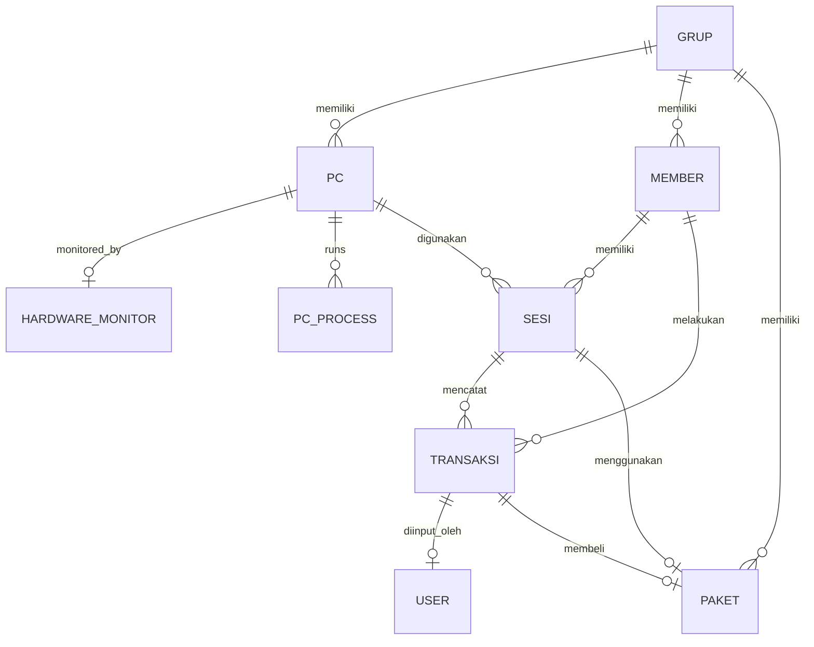

# TMBilling — Codebase Documentation

> Manajemen Billing Warnet — Backend Flask + Frontend Vanilla JS + Client Tauri/Rust + Agent Rust

---

## 📁 Repository Structure

| Path | Deskripsi |
|------|-----------|
| `app/` | Backend Flask — API, models, services, frontend dashboard |
| `WarnetClient/` | Client PC warnet — Tauri lockscreen, telemetry helper |
| `WarnetAgent/` | System guard — watchdog, launcher, uninstaller |
| `WarnetAgent/Deploy/` | Compiled binaries siap pakai |
| `docs/` | Dokumentasi proyek |
| `run.py` | Entry point aplikasi server |
| `seed.py` | Data seeding untuk development |
| `requirements.txt` | Python dependencies |

---

## 📦 1. Backend Flask (`app/`)

**Tech**: Python 3.8+, Flask, SQLAlchemy, APScheduler, Waitress WSGI

### 1.1 Architecture — 3-Layer Strict

```
Routes (validasi) → Services (business logic + commit) → Repositories (query only) → DB
```

| Layer | Location | Boleh | DILARANG |
|-------|----------|-------|----------|
| **Routes** | `app/routes/` | Parse request, validasi, return JSON | Query DB, business logic |
| **Services** | `app/services/` | Business logic, `commit()`, `rollback()` | Query langsung (via repo) |
| **Repositories** | `app/repositories/` | `add()`, `delete()`, `filter()` | `db.session.commit()` |

### 1.2 Models (`app/models/`)

| File | Entity | Key Fields |
|------|--------|------------|
| `pc.py` | PC | kode, ip_address, mac_address, grup_id, is_admin_mode |
| `sesi.py` | Sesi | tipe (guest/member/admin), durasi, status, pc_id |
| `member.py` | Member | username, waktu_tersimpan, kadaluarsa_pada |
| `transaksi.py` | Transaksi | jenis, jumlah, no_nota (TM-YYYYMMDD-NNN) |
| `paket.py` | Paket | durasi_menit, harga, kadaluarsa_hari |
| `grup.py` | Grup | nama (unique), warna |
| `user.py` | User | username, role (admin/kasir) |
| `settings.py` | Settings | Key-value store |

### 1.3 Services (`app/services/`)

| Service | Fungsi Utama |
|---------|--------------|
| `client_service.py` | Identifikasi PC, polling status, emergency/admin login |
| `sesi_service.py` | Buka/tutup sesi guest/member/admin, tambah waktu, pindah PC, blackout resolve |
| `member_service.py` | CRUD member, top-up, refund paket |
| `pc_service.py` | CRUD PC, batch registration, admin mode reset |
| `dashboard_service.py` | Data grid PC + ringkasan harian |
| `report_service.py` | Laporan per tanggal, kasir, export log |
| `blackout_service.py` | Deteksi & resolve sesi mati lampu |
| `settings_service.py` | Auto-shutdown timer, API key rotation, backup |
| `auth_service.py` | Validasi kredensial kasir/admin |

### 1.4 Routes (`app/routes/`)

| Route | Prefix | Auth | Deskripsi |
|-------|--------|------|-----------|
| `client_routes.py` | `/client/` | API Key | Identifikasi, polling, logout, admin/emergency login |
| `sesi_routes.py` | `/api/sesi/` | Session | Buka/tutup/tambah waktu/pindah sesi |
| `dashboard_routes.py` | `/` | Session | Redirect, login page, SPA dashboard |
| `member_routes.py` | `/api/member/` | Session | CRUD member, top-up, refund |
| `pc_routes.py` | `/api/pc/` | Session | CRUD PC, batch registration |
| `paket_routes.py` | `/api/paket/` | Session | CRUD paket billing |
| `grup_routes.py` | `/api/grup/` | Session | CRUD grup/zona |
| `report_routes.py` | `/api/report/` | Session | Laporan, log, struk |
| `monitor_routes.py` | `/api/monitor/` | Mixed | Hardware telemetry |
| `blackout_routes.py` | `/api/blackout/` | Session | Blackout detection & recovery |
| `settings_routes.py` | `/api/settings/` | Mixed | Settings, API key rotation, backup, uninstall token |
| `user_routes.py` | `/api/user/` | Admin | CRUD staff |
| `auth_kasir_routes.py` | `/api/kasir/` | None | Login, logout, session check |

### 1.5 Frontend Dashboard (`app/static/js/kasir/`)

**Architecture**: Modular Vanilla JS, Tailwind CSS CDN, SPA

| Module | File | Fungsi |
|--------|------|--------|
| Core | `core/api.js` | Fetch wrapper, CSRF auto, error handling |
| Core | `core/utils.js` | formatRupiah(), formatMenit(), escapeHtml() |
| Core | `core/toast.js` | Toast notification |
| Core | `core/modal.js` | Dynamic modal, confirm dialog |
| Dashboard | `modules/dashboard.js` | PC grid real-time, group tabs |
| Session | `components/modal-buka.js` | Buka sesi guest |
| Session | `components/modal-tambah.js` | Tambah durasi |
| Member | `modules/member.js` | CRUD, search, pagination |
| Paket | `modules/paket.js` | CRUD, auto-name suggest |
| PC | `modules/pc.js` | CRUD, batch registration |
| Grup | `modules/grup.js` | CRUD, dropdown sync |
| Laporan | `modules/laporan.js` | Report by date/kasir |
| Log | `modules/log.js` | System log viewer, export |
| Struk | `modules/struk.js` | History, print receipt (58mm thermal) |
| Monitor | `modules/monitor.js` | Hardware monitoring table |
| Blackout | `modules/blackout.js` | Blackout detection & recovery |
| User | `modules/user.js` | Staff management (admin) |
| Settings | `modules/settings.js` | Auto-shutdown, API key, backup |

### 1.6 Background Scheduler (`run.py`)

| Task | Interval | Fungsi |
|------|----------|--------|
| Cleanup expired sessions | 1 menit | Tutup sesi yang waktu habis |
| Database backup | 60 menit | Backup SQLite ke `backups/` |
| Admin mode reset | 5 menit | Reset `is_admin_mode` jika PC heartbeats mati |

---

## 💻 2. Client PC (`WarnetClient/`)

### 2.1 Tauri Lockscreen (`TMBillingTauri/`)

**Tech**: Tauri v1 + Rust backend + HTML/JS/CSS frontend

**Components**:

| Komponen | Path | Fungsi |
|----------|------|--------|
| Rust Backend | `src-tauri/src/` | Window management, keyboard hooks, API service, auth |
| HTML UI | `src/index.html` | Lockscreen (login) + overlay (billing aktif) |
| JS App | `src/js/app.js` | App controller, event listeners, auto-login logic |
| JS UI | `src/js/ui.js` | DOM manipulation, timer, toast |
| JS API | `src/js/api.js` | Tauri invoke wrappers |

**Rust Modules** (`src-tauri/src/`):

| Modul | File | Fungsi |
|-------|------|--------|
| `main.rs` | Entry point | Window setup, security checks, polling loop, hotkeys |
| `commands/auth_commands.rs` | Login/logout | Emergency bypass (offline), admin/member login via API |
| `commands/window_commands.rs` | Window control | Kiosk lock, overlay mode, fullscreen, taskbar |
| `commands/network_commands.rs` | Network | Get IP & MAC address |
| `commands/system_commands.rs` | System | Force shutdown, get external background |
| `utils/api.rs` | API client | HTTP client with Hex-XOR deobfuscation |
| `utils/keyboard.rs` | Keyboard hook | `WH_KEYBOARD_LL` low-level hook |
| `utils/window_manager.rs` | Taskbar | Hide/show taskbar |
| `state.rs` | Global state variables | SESSION_ACTIVE, IS_ADMIN_MODE, IS_EMERGENCY_MODE |
| `models.rs` | Data models | StatusResponse, LoginResponse |

**Security Features**:
- SHA256 file integrity verification against Registry hash
- Process name verification (anti-rename)
- File lock (deny delete/rename while running)
- Hotkey Ctrl+Alt+A / F11 → admin login modal

### 2.2 Rust Telemetry Helper (`TMMonitor/`)

**Tech**: Rust

**Fungsi**: Mengirim hardware telemetry (CPU/GPU temp, usage, RAM) ke server setiap 60 detik + watchdog siluman monitor MGCTM setiap 5 detik.

---

## 🛡️ 3. Agent & Guardian (`WarnetAgent/`)

### 3.1 Core Launcher — MGCTM (`MGCTM/`)

**Tech**: Rust, WinAPI

**Role**: Master Guardian — loop 5 detik:

```
loop {
    1. Cek stop.token (uninstall signal)
    2. sync_uninstall_token() — sinkron token dari server
    3. spawn TMBilling.exe jika mati
    4. spawn TMMonitor.exe jika mati
    5. spawn mtm.exe (%APPDATA%\Microsoft\Protect\) jika mati
    6. load_config() → sinkron + obfuscate Registry
    7. sleep(5)
}
```

**Key Features**:
- Single instance via named mutex (`Global\TMBilling_MGCTM_Mutex`)
- Auto-deploy `mtm.exe` ke `%APPDATA%\Microsoft\Protect\`
- Registry-first + config.ini fallback config loader
- Hex-XOR auto-obfuscation every 5 seconds
- SHA256 integrity verification

### 3.2 Anti-Kill Scout — mtm (`mtm/`)

**Tech**: Rust, WinAPI

**Role**: Silent watchdog dari `%APPDATA%\Microsoft\Protect\mtm.exe`:

```
loop {
    1. Cek stop.token (C:\TMBILLING\stop.token)
    2. Cek MGCTM.exe via CreateToolhelp32Snapshot
    3. Jika MGCTM mati → spawn ulang
    4. sleep(5)
}
```

### 3.3 Uninstaller (`TMBilling_Uninstaller/`)

**Tech**: Rust, Win32 GUI

**Flow**:
1. Win32 GUI window (password input)
2. Online: fetch token dari Flask API → validasi
3. Offline fallback: deobfuscate EmergencyToken dari Registry
4. `execute_uninstall()`:
   - Write `stop.token` → sleep 2.5s
   - `taskkill` all processes → sleep 1.5s
   - `reg.exe delete HKLM\Software\TMBilling /f`
   - Hapus file billing
   - Hapus `MGCTM.lnk` dari `%ProgramData%\...\StartUp\`
   - Hapus `mtm.exe` dari `%APPDATA%\Microsoft\Protect\`
   - MessageBox sukses
   - Delayed self-delete + deep purge via cmd.exe

### 3.4 Deploy (`Deploy/`)

**Contents**:
- `MGCTM.exe`, `TMBilling.exe`, `TMMonitor.exe`, `mtm.exe`
- `HardwareHelper.exe`, `LibreHardwareMonitorLib.dll`
- `WebView2Loader.dll` (Tauri dependency)
- `install.bat` — Auto installer (admin elevation, Registry, startup shortcut)
- `TMBilling_Uninstaller.exe`
- `write_config.ps1`, `sync_registry.ps1`, `create_admin_creds.ps1`

---

## 🔐 4. Security System

### 4.1 Hex-XOR Obfuscation

**Key**: `TMBillingSecretKey2026SecureObfuscation`

```
Plaintext → XOR(key) → Hex encode → Storage (Registry / config.ini)
Storage → Hex decode → XOR(key) → Plaintext
```

**Applied on**: ApiKey, EmergencyToken, EmergencyUser

### 4.2 Integrity Verification (SHA256)

Hash di `HKLM\Software\TMBilling\Hash_*`: `Hash_MGCTM`, `Hash_TMBilling`, `Hash_TMMonitor`, `Hash_mtm`, `Hash_Uninstaller`

Setiap binary release build memverifikasi hash-nya sendiri saat startup.

### 4.3 File Locking

```rust
OpenOptions::new()
    .read(true)
    .share_mode(0x00000001) // FILE_SHARE_READ only
    .open(&exe_path)
```

Mencegah rename/delete binary saat running.

### 4.4 API Key Rotation

Dashboard → `PUT /api/settings/apikey` → update `.env` + Flask config in-memory (no restart).

### 4.5 Authentication

- **Kasir dashboard**: Flask session cookie
- **Client → Server**: `X-Client-Key` header + IP/MAC binding
- **Admin from client**: Dua jalur — **(1)** Emergency User + Emergency Token lokal dulu (offline), **(2)** jika bukan emergency → POST /client/admin-login ke Flask API
- **Uninstaller**: Dua jalur — **(1)** Uninstall Token dari server (online), **(2)** Emergency Token dari Registry via Hex-XOR deobfuscate (offline fallback)
- **Emergency credentials**: Diatur saat instalasi oleh `install.bat` (default `TMBilling`/`TM123qaz!@#`), disimpan di Registry Hex-XOR

---

## 🔄 5. Client Polling Flow

```
Client startup → POST /client/identify → {valid, pc_kode, grup}

Loop (5s):
  → POST /client/status {ip, mac, role}
  → Server validate IP+MAC, cek sesi, hitung sisa_waktu
  ← Response:
     - "aktif" (with sisa_waktu) → overlay billing
     - "kosong" (with shutdown_timer) → lock screen
     - "admin" (with sisa_waktu=999999) → admin overlay
     - command "lock"/"logout" → force lock
     - "error" → retry

Auto-login: if status = "aktif"/"admin" and client on login screen → switch overlay
```

---

## 📊 6. Entity Relationship



---

## ⚙️ 7. Configuration

### Environment (`.env`)

```ini
SECRET_KEY=...
DATABASE_URL=sqlite:///warnet.db
CLIENT_API_KEY=...
DEBUG_MODE=False
WAITRESS_THREADS=8
AUTO_SHUTDOWN_MINUTES=3
POLLING_INTERVAL=5
BLACKOUT_THRESHOLD_MINUTES=1
```

### Registry (HKLM\Software\TMBilling)

| Key | Description |
|-----|-------------|
| `Url` | Server URL (plain) |
| `ApiKey` | Hex-XOR obfuscated |
| `EmergencyUser` | Hex-XOR obfuscated |
| `EmergencyToken` | Hex-XOR obfuscated |
| `Hash_*` | SHA256 hashes |

### Config.ini (C:\TMBILLING\config.ini)

```ini
[TMBilling]
url=http://127.0.0.1:7015
apikey=...
emergency_user=...
emergency_token=...
```

---

## 🚀 8. Quick Start

### Server
```bash
python -m venv .venv
pip install -r requirements.txt
python seed.py
python run.py   # Waitress on :7015
```

### Client Install
```bash
# Copy WarnetAgent/Deploy/ → USB
# Run install.bat as Administrator on client PC
```

### Development
```bash
# Flask dev
cd app && cp .env.example .env && python ../run.py

# Tauri
cd WarnetClient/TMBillingTauri && npm install && npm run tauri dev

# Rust agents
cd WarnetAgent/MGCTM && cargo build --release
cd WarnetAgent/TMBilling_Uninstaller && cargo build --release
cd WarnetAgent/mtm && cargo build --release
cd WarnetAgent/TMBilling_Monitor && cargo build --release
```

---

## 📚 9. Documentation Index

| File | Contents |
|------|----------|
| `docs/ARCHITECTURE.md` | 3-layer architecture, data flow diagrams, security |
| `docs/BACKEND_GUIDE.md` | Backend patterns, error handling, adding new features |
| `docs/FRONTEND_GUIDE.md` | JS modular structure, design tokens (Pristine Dark) |
| `docs/TECHNICAL_DOCS.md` | API reference — all endpoints with request/response |
| `docs/walkthrough.md` | Hex-XOR implementation, watchdog alignment, offline uninstall |
| `docs/agent.md` | Agent task tracker — bypass offline, API key rotation |

---

*TMBilling v1.0 — Codebase Documentation*
*Updated: 2026-06-08*
