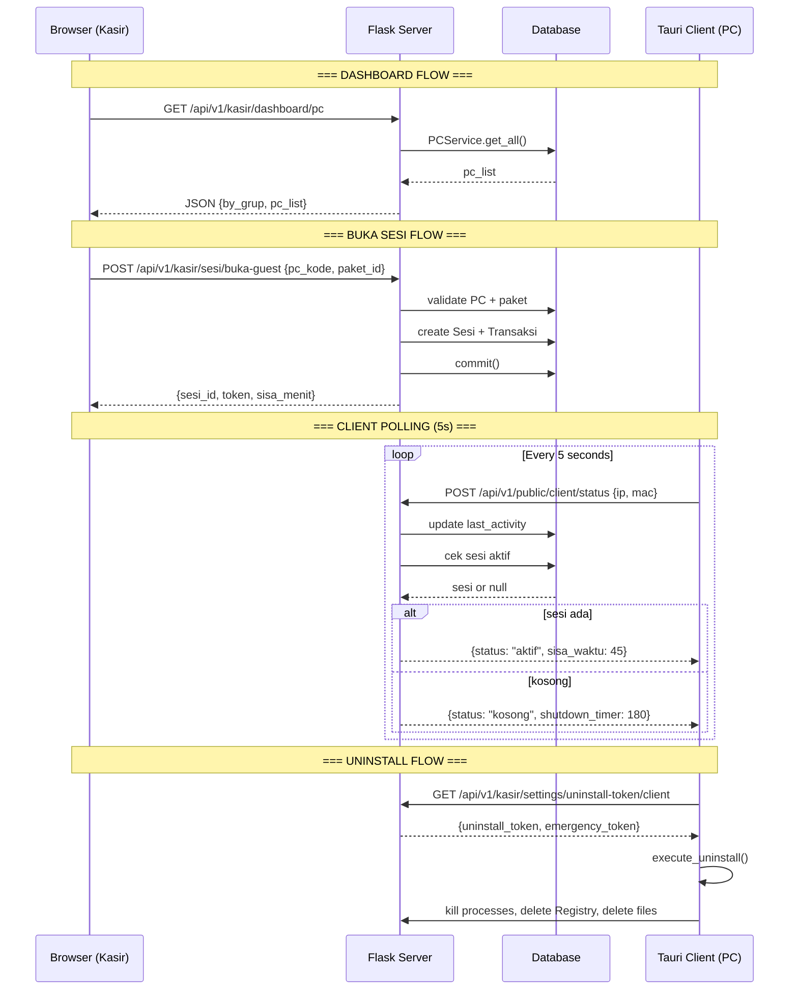
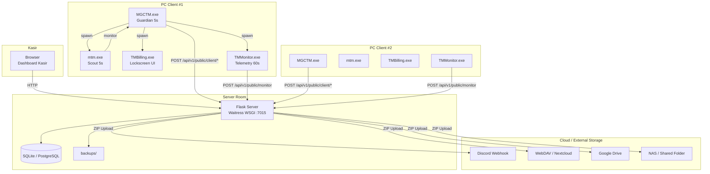
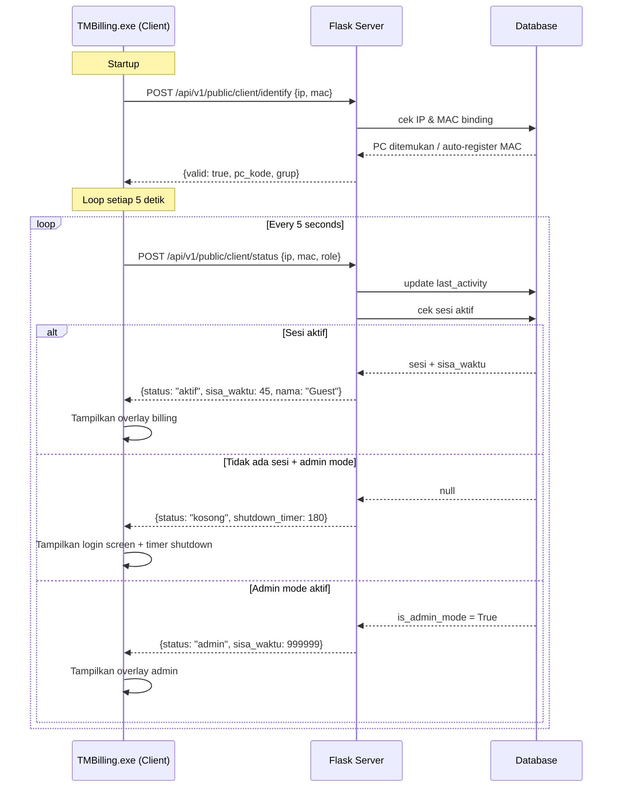
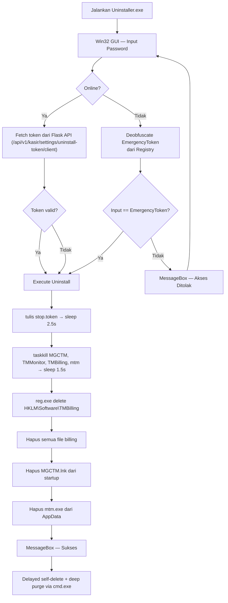
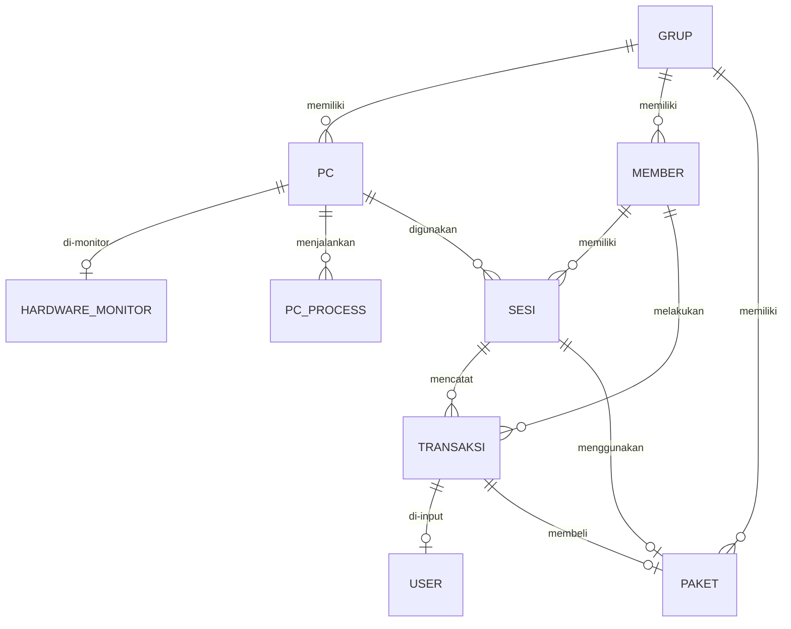

# Diagram Arsitektur & Alur Sistem TMBilling

Dokumen ini berisi kumpulan diagram lengkap yang mendeskripsikan arsitektur, alur data, dan hubungan entitas di dalam sistem TMBilling.

## 1. End-to-End Data Flow

## 2. System Topology

## 3. Client Polling Loop (5 Detik)

## 4. Uninstaller Flow

## 5. Entity Relationship

---
*TMBilling v1.4.4*
