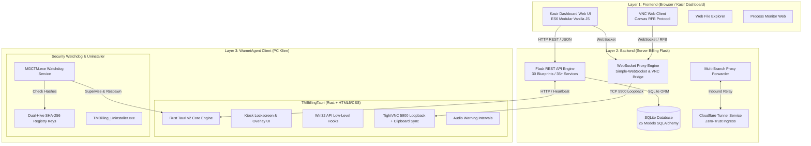

# Master Dokumentasi Teknis & Operasional TMBilling (Single Source of Truth)

> **Versi Rilis:** v1.6.2  
> **Status:** Single Source of Truth Resmi Repositori TMBilling  
> **Target Audiens:** Pengembang Backend/Frontend, Pengembang Rust/Tauri, Operator/Kasir, dan Administrator Sistem Warnet & Game Center.

---

## 📑 DAFTAR ISI (Table of Contents)

1. [Ikhtisar Sistem & Filosofi Desain](#1-ikhtisar-sistem--filosofi-desain)
2. [Arsitektur Sistem Terpadu (3-Layer SoC)](#2-arsitektur-sistem-terpadu-3-layer-soc)
   - [2.1 Backend Server (Flask + SQLite ORM + WebSocket Server)](#21-backend-server)
   - [2.2 Frontend Dashboard (Modular ES6 Vanilla JS + Responsive UI)](#22-frontend-dashboard)
   - [2.3 WarnetAgent Klien (Tauri v2 + Rust Core + Kiosk Shell)](#23-warnetagent-klien)
   - [2.4 WebSocket VNC Proxy Relay & Multi-Branch Forwarder](#24-websocket-vnc-proxy-relay--multi-branch-forwarder)
3. [Struktur Direktori & Pemetaan Kode Repositori](#3-struktur-direktori--pemetaan-kode-repositori)
4. [Katalog & Spesifikasi Mendalam Seluruh Fitur (28 Domain Fitur)](#4-katalog--spesifikasi-mendalam-seluruh-fitur-28-domain-fitur)
   - [4.1 Multi-Branch Control Panel & Remote Proxy Relay](#41-multi-branch-control-panel--remote-proxy-relay)
   - [4.2 Multi-PC Selection & Batch Actions Engine (`remoteBatch`)](#42-multi-pc-selection--batch-actions-engine)
   - [4.3 TightVNC Remote Control System & Bi-directional Clipboard Sync](#43-tightvnc-remote-control-system--bi-directional-clipboard-sync)
   - [4.4 Blackout Auto-Recovery System (Toleransi Mati Lampu & Uptime Tracker)](#44-blackout-auto-recovery-system-toleransi-mati-lampu--uptime-tracker)
   - [4.5 5-Layer WarnetAgent Anti-Tamper Security & Registry Hash Verification](#45-5-layer-warnetagent-anti-tamper-security--registry-hash-verification)
   - [4.6 Hardware Baseline Monitoring & Theft Alerts](#46-hardware-baseline-monitoring--theft-alerts)
   - [4.7 Remote Process Monitor & Task Killer](#47-remote-process-monitor--task-killer)
   - [4.8 Web File Explorer (Remote Disk Explorer)](#48-web-file-explorer-remote-disk-explorer)
   - [4.9 Screenshot Monitor with Natural Sorting](#49-screenshot-monitor-with-natural-sorting)
   - [4.10 POS Kantin & Billing FnB Multi-Payment (Cash/QRIS/Bank + Struk Thermal)](#410-pos-kantin--billing-fnb-multi-payment)
   - [4.11 Dynamic Tutorials CMS & Custom CKEditor Builder](#411-dynamic-tutorials-cms--custom-ckeditor-builder)
   - [4.12 Cloudflare Tunnel Auto-Service](#412-cloudflare-tunnel-auto-service)
   - [4.13 Centralized Versioning System (`config.py` Truth)](#413-centralized-versioning-system)
   - [4.14 RBAC Kasir & Centralized Audit Log System](#414-rbac-kasir--centralized-audit-log-system)
   - [4.15 Floor Plan & Dynamic Visual Room Layout](#415-floor-plan--dynamic-visual-room-layout)
   - [4.16 Database Maintenance & Cloud/Local Backup UI](#416-database-maintenance--cloudlocal-backup-ui)
   - [4.17 Manajemen Member, Paket & Billing Rates](#417-manajemen-member-paket--billing-rates)
   - [4.18 Shift Kasir & Manajemen Kas Fisik](#418-shift-kasir--manajemen-kas-fisik)
   - [4.19 Catatan Kasir & Shift Handover Scratchpad](#419-catatan-kasir--shift-handover-scratchpad)
   - [4.20 Turnamen & Bracket eSports Engine](#420-turnamen--bracket-esports-engine)
   - [4.21 Public TV Billboard & Scoreboard Display](#421-public-tv-billboard--scoreboard-display)
   - [4.22 Owner Analytics & Business Intelligence](#422-owner-analytics--business-intelligence)
   - [4.23 Emergency Mode & Offline Fallback (SHA-256 Auth)](#423-emergency-mode--offline-fallback)
   - [4.24 Audio Warning Intervals & Sound System (15m, 10m, 5m, 1m)](#424-audio-warning-intervals--sound-system)
   - [4.25 Responsive Dual-Layout (1024px vs 1920px & Mobile Touch)](#425-responsive-dual-layout)
   - [4.26 Live Search Debouncing & PC Code Auto-Dash Formatting](#426-live-search-debouncing--pc-code-auto-dash-formatting)
   - [4.27 Integrasi Mikrotik Bandwidth Management (RouterOS Queue API)](#427-integrasi-mikrotik-bandwidth-management)
   - [4.28 Maintenance Ticket & Issue Reporting System](#428-maintenance-ticket--issue-reporting-system)
5. [Panduan Teknis Backend (Flask & Python)](#5-panduan-teknis-backend-flask--python)
   - [5.1 Daftar Blueprint & Routing](#51-daftar-blueprint--routing)
   - [5.2 Service Layer & Pola Arsitektur](#52-service-layer--pola-arsitektur)
   - [5.3 Skema Database & 25 Model SQLAlchemy](#53-skema-database--25-model-sqlalchemy)
6. [Panduan Teknis Frontend (Modular Vanilla JS & CSS)](#6-panduan-teknis-frontend-modular-vanilla-js--css)
   - [6.1 Arsitektur Core JS](#61-arsitektur-core-js)
   - [6.2 Modul-Modul Fitur Kasir](#62-modul-modul-fitur-kasir)
7. [Panduan Teknis WarnetAgent (Tauri v2 Rust Core)](#7-panduan-teknis-warnetagent-tauri-v2-rust-core)
   - [7.1 TMBillingTauri (Client Lock & Overlay)](#71-tmbillingtauri)
   - [7.2 MGCTM Watchdog Daemon & Dual-Hive Hashes](#72-mgctm-watchdog-daemon)
   - [7.3 TMBilling_Uninstaller](#73-tmbilling_uninstaller)
   - [7.4 Deploy Scripts & TightVNC Registry](#74-deploy-scripts--tightvnc-registry)
8. [Spesifikasi Protokol API & WebSocket](#8-spesifikasi-protokol-api--websocket)
9. [Panduan Operasional Kasir & Troubleshooting](#9-panduan-operasional-kasir--troubleshooting)
10. [Panduan Kontribusi, Testing & Build Pipeline](#10-panduan-kontribusi-testing--build-pipeline)

---

## 1. Ikhtisar Sistem & Filosofi Desain

**TMBilling** adalah sistem otomasi operasional, billing, manajemen transaksi FnB/Kantin, monitoring hardware, proteksi keamanan, dan kendali jarak jauh (remote control) terintegrasi untuk warnet modern, esports arena, dan game center berstandar enterprise.

### Filosofi Desain Utama:
1. **Resilience First (Zero Session Loss)**: Sesi billing pelanggan tidak boleh hilang akibat mati lampu (*blackout*), PC hang/crash, atau server restart. Sistem mampu melanjutkan sisa waktu secara otomatis.
2. **Ironclad Anti-Tamper**: Klien warnet diproteksi berlapis (Tauri v2 Rust + Win32 API hooks + Dual-Hive Registry SHA-256 Hashes + Watchdog Daemon terpisah) agar tidak bisa di-bypass oleh software cheat, Task Manager, ataupun penggantian file binary.
3. **Seamless Multi-Branch & Remote Operation**: Owner atau operator dapat mengawasi, mengontrol, dan berpindah antar-cabang dari satu dashboard terpusat tanpa memerlukan IP publik statis (via Cloudflare Tunnel & Proxy Relay).
4. **Clean SoC & Zero-Slop Architecture**: Backend Flask terstruktur dengan *Clean Architecture* (Routes -> Services -> Repositories -> Models), Frontend menggunakan Vanilla JS modular tanpa framework berat, dan Klien Kiosk menggunakan Rust + Webview2 yang sangat hemat memori.

---

## 2. Arsitektur Sistem Terpadu (3-Layer SoC)



### 2.1 Backend Server
- **Framework**: Python 3.10+ dengan Flask, Flask-SQLAlchemy, Flask-Migrate, Flask-CORS, Flask-WTF.
- **Asynchronous & WebSocket**: Menggunakan `simple-websocket` untuk real-time telemetry, live screenshot streaming, dan TightVNC RFB binary frame multiplexing.
- **Service Layer**: Pemisahan logika bisnis dari endpoint HTTP menggunakan 35+ service class independen.

### 2.2 Frontend Dashboard
- **Teknologi**: Modular ES6 Vanilla JavaScript (tanpa Node.js bundler runtime), TailwindCSS styling, Font Awesome icon set.
- **Arsitektur**: Core API layer (`app/static/js/kasir/core/api.js`), Event Bus, Theme Variables, dan 32+ modul fitur terisolasi.
- **Responsivitas**: Dual layout adaptif (1024px compact mode s/d 1920px full widescreen) serta dukungan gesture sentuh untuk tablet/smartphone kasir.

### 2.3 WarnetAgent Klien
- **Teknologi**: Rust + Tauri v2 (berbasis Microsoft Webview2).
- **Kiosk Shell**: Mengunci tampilan Windows (Disable `WinKey`, `Ctrl+Alt+Del`, `Alt+Tab`, `Alt+F4`, `Ctrl+Shift+Esc`), menutup akses taskbar dan desktop sebelum sesi dibuka.
- **Overlay State**: Menampilkan floating bar widget (sisa waktu, tarif, billing FnB, QRIS payment, tombol ganti password, report tiket).

### 2.4 WebSocket VNC Proxy Relay & Multi-Branch Forwarder
- Menjembatani canvas web kasir dengan TightVNC Server yang berjalan di port `5900` PC klien.
- Meneruskan frame RFB (Remote FrameBuffer), event mouse/keyboard, dan pertukaran teks clipboard secara dua arah.
- Mendukung *Multi-Branch Inbound Relay* untuk memanipulasi dan memonitor PC cabang lain langsung dari dashboard lokal.

---

## 3. Struktur Direktori & Pemetaan Kode Repositori

```text
c:\Project GIT\TMBilling
├── app/                                # Backend Server Flask & Frontend Kasir
│   ├── config.py                       # Single Source of Version Truth (VERSION = "1.6.2")
│   ├── models/                         # 25 Database Model SQLAlchemy
│   │   ├── branch/                     # Branch & BranchInbound
│   │   ├── game/                       # Game & GameKategori
│   │   ├── grup/                       # Grup Ruangan / Tarif (Reguler/VIP)
│   │   ├── hardware/                   # HardwareMonitor & PCProcess
│   │   ├── maintenance/                # MaintenanceTicket
│   │   ├── member/                     # Member accounts & prepaid balances
│   │   ├── menu/                       # MenuItem & TransaksiMenu (POS Kantin)
│   │   ├── mikrotik/                   # MikroTikConfig
│   │   ├── paket/                      # Paket billing (Jam, Malam, Personal)
│   │   ├── pc/                         # PC registry & PCUptimeLog
│   │   ├── sesi/                       # Sesi billing aktif & selesai
│   │   ├── settings/                   # Global settings & cloud configs
│   │   ├── shift/                      # ShiftRecord & modal kas
│   │   ├── tournament/                 # Turnamen, Tim, Tahap, Match
│   │   ├── transaksi/                  # Transaksi pembayaran billing
│   │   ├── tutorial/                   # SystemTutorial (CMS CMS)
│   │   └── user/                       # User & Role RBAC
│   ├── routes/                         # 30 Blueprint HTTP / WebSocket
│   │   ├── auth/                       # Login/Logout kasir & admin
│   │   ├── backup/                     # Database local & cloud backup
│   │   ├── blackout/                   # Toleransi & recovery mati lampu
│   │   ├── branch/                     # Multi-branch routing & inbound proxy
│   │   ├── client/                     # Handshake & telemetry client agent
│   │   ├── dashboard/                  # Dashboard summary & stats
│   │   ├── fileexplorer/               # Remote web disk explorer
│   │   ├── game/                       # Game launcher & icon cropper
│   │   ├── hardware/                   # Uptime logs & baseline discrepancy
│   │   ├── maintenance/                # Ticket reporting & tracking
│   │   ├── member/                     # Member management & deposit
│   │   ├── menu/                       # POS FnB, order & thermal struk
│   │   ├── mikrotik/                   # RouterOS API integration
│   │   ├── monitor/                    # PC monitor, batch actions, processes
│   │   ├── notes/                      # Kasir sticky notes & handover
│   │   ├── paket/                      # Paket management
│   │   ├── pc/                         # PC CRUD, floor plan coordinates
│   │   ├── public/                     # Public TV billboard & scoreboard
│   │   ├── report/                     # Laporan harian, billing, kantin, shift
│   │   ├── server_monitor/             # Server health (CPU, RAM, Disk)
│   │   ├── sesi/                       # Billing sessions lifecycle & batch
│   │   ├── settings/                   # IP whitelist, Cloudflare, DB vacuum
│   │   ├── shift/                      # Kasir shift drawer management
│   │   ├── tournament/                 # Turnamen & bracket engine
│   │   ├── tutorial/                   # CMS Tutorials & editor uploads
│   │   ├── user/                       # RBAC user & audit logs
│   │   └── vnc/                        # TightVNC WebSocket proxy stream
│   ├── services/                       # 35+ Service Layer Business Logic
│   ├── repositories/                   # Data Access Layer & DB Query Helpers
│   ├── static/                         # Static Assets
│   │   ├── css/                        # TailwindCSS build & custom styling
│   │   ├── js/kasir/                   # Modular ES6 JavaScript Frontend
│   │   │   ├── app.js                  # Main Application Entrypoint
│   │   │   ├── core/                   # api.js, modal.js, toast.js, utils.js
│   │   │   ├── components/             # Modal buka sesi, tambah durasi, dll.
│   │   │   └── modules/                # 28 modul JS fitur terisolasi
│   │   └── sounds/                     # Audio warning bells (15m, 10m, 5m, 1m)
│   └── templates/                      # Jinja2 HTML Templates
│       ├── kasir/                      # Dashboard Kasir & Modals
│       ├── member/                     # Member Portal Kiosk
│       └── tv/                         # Public Billboard & Scoreboard
├── docs/                               # Master Dokumentasi Teknis
│   ├── DOCUMENTATION.md                # Single Source of Truth (File Ini)
│   └── superpowers/                    # Arsip Riwayat Perancangan & Specs
├── tools/                              # Build & Utility Tools
│   └── ckeditor-builder/               # Custom CKEditor 5 Build untuk CMS
├── WarnetAgent/                        # Source Code Klien Warnet (Rust / Tauri)
│   ├── TMBillingTauri/                 # Main Client Application
│   │   ├── src/                        # UI HTML/JS (Kiosk, Overlay, Admin Lock)
│   │   ├── src-tauri/                  # Rust Core, Win32 Hooks, IPC Commands
│   │   └── package.json
│   ├── MGCTM/                          # Watchdog Daemon (Supervisi TMBilling.exe)
│   ├── TMBilling_Uninstaller/          # Secure Uninstaller (Registry & Service Clean)
│   └── Deploy/                         # Deployment & Firewall Helper Scripts
├── build_and_deploy.bat                # Skrip Build Otomatis Klien & Server
├── developer_install.bat               # Skrip Inisialisasi Dev Environment Cepat
├── CHANGELOG.md                        # Riwayat Rilis Lengkap (Keep a Changelog)
└── README.md                           # Ringkasan Proyek, Quickstart & Panduan Instalasi
```

---

## 4. Katalog & Spesifikasi Mendalam Seluruh Fitur (28 Domain Fitur)

### 4.1 Multi-Branch Control Panel & Remote Proxy Relay
- **Deskripsi**: Memungkinkan kasir atau owner di satu cabang (atau via Cloudflare Tunnel) mengelola dan beralih (*switch*) ke cabang lain secara instan tanpa perlu login ulang.
- **Mekanisme Inbound**: Model `BranchInbound` dan `Branch` mencatat token autentikasi, URL ingress remote, dan status latensi cabang.
- **Session Isolation**: Kasir lokal beroperasi di database lokal, sedangkan ketika beralih ke cabang remote, `branch_proxy_service.py` meneruskan request REST/WebSocket secara aman ke server cabang target.
- **Zona Waktu Multi-Cabang**: Mendukung sinkronisasi zona waktu otomatis (`WIB`, `WITA`, `WIT`) pada pencatatan transaksi dan durasi sesi.

### 4.2 Multi-PC Selection & Batch Actions Engine (`remoteBatch`)
- **Deskripsi**: Operator kasir dapat memilih banyak PC sekaligus untuk melakukan aksi massal hanya dengan beberapa klik.
- **Metode Seleksi**:
  - *Checkbox Selection*: Centang pada card PC di dashboard.
  - *Card-to-Card Drag / Shift-Click*: Seleksi rentang PC sekaligus.
- **Operasi Batch yang Didukung**:
  - `Batch Shutdown`: Mematikan seluruh PC terpilih sekaligus.
  - `Batch Restart`: Merestart seluruh PC terpilih.
  - `Batch Lock / Unlock`: Mengunci/membuka kunci layar klien secara massal.
  - `Batch Clear Sesi`: Menutup seluruh sesi yang telah selesai.
  - `Batch Move PC`: Memindahkan antrian sesi ke blok PC lain.
  - `Batch Apply Paket`: Menerapkan paket promosi secara bersamaan ke beberapa PC.
- **Implementasi API**: `API.monitor.remoteBatch({ action, pc_ids })` di [app/static/js/kasir/core/api.js](file:///c:/Project%20GIT/TMBilling/app/static/js/kasir/core/api.js) memanggil endpoint `/api/monitor/remote-batch`.

### 4.3 TightVNC Remote Control System & Bi-directional Clipboard Sync
- **Deskripsi**: Kasir dapat melihat layar dan mengontrol keyboard/mouse PC klien secara *real-time* langsung dari browser tanpa perlu menginstall VNC viewer eksternal.
- **Arsitektur Loopback 5900**: TightVNC Server di klien mendengarkan pada port `127.0.0.1:5900`.
- **WebSocket RFB Proxy**: Backend Flask meneruskan binary frame RFB ke canvas HTML5 di dashboard (`vnc_client.js`).
- **Bi-directional Clipboard Sync**: Teks yang disalin di browser kasir otomatis terkirim ke clipboard Windows PC klien, dan sebaliknya teks yang disalin di PC klien disinkronkan ke browser kasir via channel WebSocket.
- **Auto-Firewall & Fail-Fast Multiplexing**: Skrip `allow_firewall.bat` memastikan port TightVNC diizinkan oleh Windows Firewall, dan mekanisme multiplexing token mencegah tabrakan sesi VNC antar kasir.

### 4.4 Blackout Auto-Recovery System (Toleransi Mati Lampu & Uptime Tracker)
- **Deskripsi**: Proteksi otomatis terhadap pemadaman listrik (*blackout*) mendadak di warnet.
- **Pencatatan Uptime & Offline Tracker**: Menggunakan tabel `PCUptimeLog` yang merekam *heartbeat* klien setiap beberapa detik.
- **Toleransi Blackout**: Jika listrik padam mendadak, server mendeteksi status offline seluruh PC secara serentak. Saat listrik menyala kembali dan PC booting, sistem secara cerdas **tidak memotong durasi pelanggan** selama masa mati lampu, melainkan memulihkan sisa waktu dan paket sesi secara otomatis (*Auto Session Resume*).
- **Hard Delete Uptime Log**: Admin dapat membersihkan riwayat log uptime lama dengan konfirmasi aman.

### 4.5 5-Layer WarnetAgent Anti-Tamper Security & Registry Hash Verification
- **Deskripsi**: Pertahanan 5 lapis untuk mencegah kecurangan (*bypass billing*), mematikan process lockscreen, atau mengganti binary klien.
- **Lapis 1 - Win32 Low-Level Hooks**: Mencegah hotkey sistem Windows (`WinKey`, `Ctrl+Alt+Del`, `Alt+Tab`, `Alt+F4`, `Ctrl+Shift+Esc`).
- **Lapis 2 - Taskbar & Desktop Shield**: Menyembunyikan Start Menu, Taskbar, dan ikon Desktop saat layar terkunci.
- **Lapis 3 - Dual-Hive SHA-256 Binary Integrity**:
  - Binary hash SHA-256 dari seluruh file executable klien disimpan di Registry Windows pada dua hive independen (`HKCU` dan `HKLM`):
    - `Hash_MGCTM` (Hash binary Watchdog)
    - `Hash_TMBilling` (Hash binary Tauri Kiosk)
    - `Hash_TMMonitor` / `Hash_mtm` (Hash modul monitor)
    - `Hash_Uninstaller` (Hash binary uninstaller)
  - Sebelum eksekusi, hash file fisik diverifikasi terhadap registry. Jika terjadi perbedaan (file dimodifikasi/di-patch), klien menolak berjalan dan mengunci PC.
- **Lapis 4 - Watchdog Daemon (`MGCTM.exe`)**: Process independen berhak Administrator yang terus memantau `TMBilling.exe`. Jika `TMBilling.exe` dimatikan paksa (misal via process hacker), `MGCTM.exe` seketika me-respawn klien dan mengunci sistem.
- **Lapis 5 - Emergency Credentials SHA-256**: Autentikasi darurat offline berbasis hash SHA-256 yang aman untuk membuka kunci PC oleh teknisi saat jaringan server terputus.

### 4.6 Hardware Baseline Monitoring & Theft Alerts
- **Deskripsi**: Merekam *snapshot* spesifikasi hardware PC klien (CPU Serial/Model, GPU Model, RAM Capacity & Stick Count, Disk Serial Numbers) ke dalam tabel `HardwareMonitor`.
- **Deteksi Pencurian / Pergantian**: Setiap kali PC klien booting, agent membandingkan hardware saat ini dengan baseline tersimpan. Jika ada RAM yang dicabut atau GPU/Disk yang ditukar, dashboard kasir seketika memunculkan alert diskrepansi visual berkedip merah dan notifikasi suara darurat.

### 4.7 Remote Process Monitor & Task Killer
- **Deskripsi**: Kasir dapat melihat seluruh aplikasi dan proses yang sedang berjalan di PC klien tertentu secara langsung dari modal web dashboard.
- **Fitur**:
  - Menampilkan nama proses, PID, CPU usage, dan Memory usage.
  - Tombol **End Task / Kill Process** jarak jauh untuk mematikan game yang not-responding atau software terlarang.

### 4.8 Web File Explorer (Remote Disk Explorer)
- **Deskripsi**: File manager jarak jauh berbasis web untuk PC klien.
- **Fitur**:
  - Menjelajahi drive (`C:\`, `D:\`, dll.) dan direktori PC klien.
  - Upload file dari kasir ke klien (misal file config game atau save data).
  - Download file dari klien ke komputer kasir.
  - Preview file teks dan gambar langsung di browser kasir.

### 4.9 Screenshot Monitor with Natural Sorting
- **Deskripsi**: Layar pengawasan visual yang menampilkan *thumbnail live screenshot* dari seluruh PC klien yang aktif.
- **Natural Sorting**: Daftar PC terurut secara natural (`PC-01`, `PC-02`, ..., `PC-09`, `PC-10`, `PC-11`, bukan urutan ASCII yang melompat).
- **Live Zoom**: Klik thumbnail untuk memperbesar screenshot secara instan tanpa lag.

### 4.10 POS Kantin & Billing FnB Multi-Payment (Cash/QRIS/Bank + Struk Thermal)
- **Deskripsi**: Modul kasir kantin / FnB lengkap yang terintegrasi langsung dengan billing PC.
- **Fitur**:
  - Manajemen katalog menu (`MenuItem`), kategori (Makanan, Minuman, Snack, Voucher), dan stok barang.
  - Opsi *Unlimited Stock* untuk item yang tidak memerlukan pengurangan inventaris otomatis.
  - **Multi-Metode Pembayaran**: Tunai (Cash), QRIS Dinamis/Statis, dan Transfer Bank.
  - **Charge to PC**: Tagihan makanan/minuman bisa langsung dibebankan ke sesi PC pelanggan dan dibayar saat sesi selesai.
  - **Cetak Struk Thermal**: Format struk 58mm / 80mm ESC/POS dengan logo warnet, rincian pesanan, total rupiah, dan footer terima kasih.

### 4.11 Dynamic Tutorials CMS & Custom CKEditor Builder
- **Deskripsi**: Sistem Content Management System (CMS) mandiri di dalam aplikasi kasir untuk membuat SOP, tutorial pemakaian, dan panduan operator warnet.
- **Fitur**:
  - Custom CKEditor 5 Build (berada di `tools/ckeditor-builder`) yang mendukung format teks kaya, tabel, highlight, dan upload gambar lokal otomatis saat artikel disimpan.
  - *Smart Tutorial Seeding*: Server otomatis menginisialisasi panduan standar saat database baru dibuat.
  - *Export / Import Tutorial*: Kemampuan backup dan restore artikel panduan.

### 4.12 Cloudflare Tunnel Auto-Service
- **Deskripsi**: Integrasi Cloudflare Tunnel bawaan untuk menghubungkan server billing lokal ke domain internet secara aman tanpa perlu port forwarding atau IP publik statis.
- **Fitur**:
  - Penyimpanan token Cloudflare yang persisten di database `Settings`.
  - Instalasi otomatis service background `cloudflared.exe`.
  - Kemudahan akses bagi Owner untuk melihat laporan keuangan dan analitik dari mana saja melalui smartphone.

### 4.13 Centralized Versioning System (`config.py` Truth)
- **Deskripsi**: Standarisasi nomor versi aplikasi terpusat pada file [app/config.py](file:///c:/Project%20GIT/TMBilling/app/config.py) (`VERSION = "1.6.2"`).
- **Penyebaran Otomatis**: Variabel versi ini otomatis diinjeksikan ke template Jinja2 (footer UI kasir), endpoint REST `/api/version`, dan response handshake klien agent.

### 4.14 RBAC Kasir & Centralized Audit Log System
- **Deskripsi**: Role-Based Access Control dengan 3 tingkatan pengguna: `Super Admin`, `Admin`, dan `Kasir`.
- **Audit Logs**: Seluruh aktivitas krusial (buka sesi, tambah waktu, hapus member, edit harga paket, diskon, refund, pembukaan laci kas) dicatat dalam tabel audit log berformat terstandarisasi.
- **Pembersihan Log dengan Otorisasi Supervisor**: Riwayat audit log tidak dapat dihapus sembarangan dan membutuhkan verifikasi password level Administrator/Super Admin.

### 4.15 Floor Plan & Dynamic Visual Room Layout
- **Deskripsi**: Denah visual warnet interaktif 2 dimensi di dashboard kasir (`map_view.js`).
- **Fitur**:
  - Node PC dapat digeser (*drag and drop*) sesuai tata letak meja fisik di warnet.
  - Indikator warna dinamis: Hijau (Kosong/Tersedia), Merah (Sesi Aktif), Oranye (Sisa Waktu < 10 Menit), Abu-abu (Offline).
  - Klik langsung pada node meja untuk membuka sesi atau melihat detail PC.

### 4.16 Database Maintenance & Cloud/Local Backup UI
- **Deskripsi**: Fasilitas pemeliharaan database SQLite internal agar tetap kencang dan aman dari korupsi data.
- **Fitur**:
  - *Auto Backup Lokal*: Backup terjadwal berkala ke folder arsip lokal.
  - *Cloud Backup Rotation*: Sinkronisasi backup ke penyimpanan cloud eksternal dengan retensi rotasi otomatis.
  - *SQLite VACUUM & Optimize*: Mengompresi dan merapikan indeks database langsung dari tombol di pengaturan.
  - *Database Restore Modal*: Antarmuka pemulihan database dengan proteksi konfirmasi ganda.

### 4.17 Manajemen Member, Paket & Billing Rates
- **Deskripsi**: Pengelolaan akun pelanggan member, saldo deposit, dan paket promosi warnet.
- **Fitur**:
  - Akun Member: Login dengan username/password di PC klien, auto-potong saldo deposit per detik.
  - Paket Promosi: Paket Personal, Paket 2 Jam, Paket 5 Jam, Paket Malam (Begadang).
  - Custom Group Rates: Tarif berbeda untuk tipe ruangan Reguler, VIP, Sofa, atau VVIP Simulator.
  - Reset State Sesi: Proteksi pembersihan data sesi sementara saat PC selesai digunakan.

### 4.18 Shift Kasir & Manajemen Kas Fisik
- **Deskripsi**: Manajemen pergantian jam kerja operator/kasir warnet.
- **Fitur**:
  - Kasir wajib memasukkan nominal **Modal Awal Kas** saat membuka shift.
  - Sistem menghitung total pendapatan tunai billing, pendapatan FnB, dan pembayaran digital selama jam kerja berlangsung.
  - Saat tutup shift, kasir memasukkan **Uang Fisik di Laci**, dan sistem mencatat selisih (*selisih lebih / selisih kurang*) untuk pelaporan ke owner.

### 4.19 Catatan Kasir & Shift Handover Scratchpad
- **Deskripsi**: Papan catatan (*scratchpad*) digital terintegrasi di dashboard kasir (`catatan`).
- **Fitur**:
  - Tempat operator meninggalkan pesan operasional untuk shift berikutnya (contoh: "Meja 05 keyboard tombol spasi agak keras, sudah dilaporkan ke teknisi").
  - Catatan disimpan persisten di database dan dapat dibaca oleh seluruh kasir dan admin.

### 4.20 Turnamen & Bracket eSports Engine
- **Deskripsi**: Sistem manajemen turnamen warnet bawaan untuk game kompetitif (Valorant, MLBB, Dota 2, dll.).
- **Fitur**:
  - Pembuatan bagan turnamen (*Single Elimination* & *Double Elimination*).
  - Pendaftaran nama tim dan daftar susunan pemain (*roster*).
  - Update skor pertandingan secara *live* yang terhubung ke layar TV Public.

### 4.21 Public TV Billboard & Scoreboard Display
- **Deskripsi**: Halaman antarmuka khusus untuk ditampilkan pada layar TV besar atau monitor proyektor di lobi warnet (`/tv`).
- **Fitur**:
  - Menampilkan daftar PC yang sedang kosong / terpakai beserta sisa waktu.
  - Menampilkan *Running Text* pengumuman promo, harga paket, atau peraturan warnet.
  - Menampilkan bagan dan klasemen turnamen game yang sedang berjalan.

### 4.22 Owner Analytics & Business Intelligence
- **Deskripsi**: Dashboard grafik analitik bisnis khusus untuk pemilik warnet (*Owner*).
- **Metrik Utama**:
  - Grafik tren pendapatan harian, mingguan, dan bulanan.
  - Analisis jam sibuk (*Peak Hours Occupancy Heatmap*) untuk optimasi promosi.
  - Perbandingan rasio keuntungan antara pendapatan sewa PC vs penjualan F&B kantin.

### 4.23 Emergency Mode & Offline Fallback (SHA-256 Auth)
- **Deskripsi**: Mekanisme penanganan darurat ketika jaringan lokal warnet terputus total dari server billing.
- **Fitur**:
  - Klien agent menyediakan jendela darurat dengan verifikasi hash SHA-256 password admin.
  - Memungkinkan teknisi masuk ke mode desktop Windows untuk perbaikan driver/jaringan tanpa harus mematikan PC secara paksa.

### 4.24 Audio Warning Intervals & Sound System (15m, 10m, 5m, 1m)
- **Deskripsi**: Sistem peringatan suara otomatis pada PC klien saat sesi pelanggan hampir habis.
- **Interval Peringatan**:
  - Suara notifikasi berbunyi pada sisa waktu **15 Menit**, **10 Menit**, **5 Menit**, dan **1 Menit**.
  - Mengingatkan pelanggan untuk segera menambah durasi ke kasir sebelum PC otomatis terkunci.
  - Volume audio notifikasi dapat dikonfigurasi dari backend.

### 4.25 Responsive Dual-Layout (1024px vs 1920px & Mobile Touch)
- **Deskripsi**: Desain antarmuka fleksibel yang menyesuaikan resolusi monitor kasir secara otomatis.
- **Dukungan Tampilan**:
  - *Compact Dual-Row Table Layout*: Optimal pada monitor kasir beresolusi 1024x768 atau 1366x768.
  - *Widescreen Grid View*: Optimal pada monitor Full HD 1920x1080.
  - *Mobile Touch Scrolling*: Pengoperasian mulus menggunakan layar sentuh tablet/smartphone.

### 4.26 Live Search Debouncing & PC Code Auto-Dash Formatting
- **Deskripsi**: Standarisasi input kasir untuk kecepatan dan akurasi tinggi.
- **Fitur**:
  - Pencarian nomor PC atau member dilengkapi filter *Debounce (300ms)* untuk mengurangi beban query.
  - *Auto-Prefix Dash*: Input kasir secara otomatis memformat nomor PC (misal mengetik `1` otomatis menjadi `PC-01`).

### 4.27 Integrasi Mikrotik Bandwidth Management (RouterOS Queue API)
- **Deskripsi**: Integrasi langsung antara server billing dan router Mikrotik warnet via RouterOS API.
- **Fitur**:
  - Secara otomatis mengatur limit bandwidth download/upload pada IP PC klien saat sesi billing aktif.
  - Memutus (*drop/block*) akses internet PC klien ketika sesi billing habis atau PC dalam status terkunci.

### 4.28 Maintenance Ticket & Issue Reporting System
- **Deskripsi**: Sistem tiket pelaporan kerusakan perangkat keras atau kendala teknis di warnet.
- **Fitur**:
  - Pelanggan dapat melaporkan kendala langsung dari widget overlay PC klien (misal mouse macet atau headset mati sebelah).
  - Kasir menerima notifikasi tiket, mengubah status menjadi `In-Progress` atau `Resolved`, dan merekam riwayat perbaikan oleh teknisi.

---

## 5. Panduan Teknis Backend (Flask & Python)

### 5.1 Daftar Blueprint & Routing
Backend TMBilling terbagi ke dalam 30 Blueprint modular di `app/routes/`:
- `auth_routes.py` & `auth_kasir_routes.py`: Manajemen autentikasi login session kasir dan administrator.
- `backup_routes.py`: Endpoint pemicu backup database, download backup `.db`, dan restore database.
- `blackout_routes.py`: Handler deteksi pemadaman listrik dan pemulihan sesi pelanggan.
- `branch_routes.py`: Routing multi-cabang, registrasi inbound connection, dan relay proxy.
- `client_routes.py`: Komunikasi IPC dan heartbeat agent klien warnet.
- `dashboard_routes.py`: API penyedia data statistik ringkas dashboard kasir.
- `fileexplorer_routes.py`: API file manager jarak jauh untuk PC klien.
- `game_kasir_routes.py` & `game_public_routes.py`: Manajemen katalog game dan katalog publik.
- `grup_routes.py`: CRUD grup kategori ruangan / tarif.
- `uptime_routes.py`: Pemantauan uptime PC, riwayat hardware baseline, dan penghapusan log.
- `maintenance_routes.py`: Pengelolaan tiket pemeliharaan dan pelaporan kendala.
- `member_routes.py` & `member_portal_routes.py`: Manajemen akun member, isi saldo, dan portal member.
- `menu_routes.py`: Manajemen produk F&B kantin, pesanan, dan cetak struk thermal.
- `mikrotik_routes.py`: Konfigurasi RouterOS API dan manajemen queue bandwidth.
- `monitor_routes.py`: Monitoring PC klien, live screenshot, process manager, dan aksi batch `remote-batch`.
- `note_routes.py`: Scratchpad catatan kasir dan memo handover shift.
- `paket_routes.py`: Manajemen paket jam/malam billing.
- `pc_routes.py`: CRUD PC, alamat IP, MAC address, dan koordinat denah floor plan.
- `tv_public_routes.py`: Penyedia data halaman TV display lobi.
- `report_routes.py`: Generator laporan keuangan harian, laporan billing, kantin, dan shift kasir.
- `server_monitor_routes.py`: Monitoring performa CPU, RAM, dan storage server billing.
- `sesi_routes.py`: Siklus hidup sesi billing (buka sesi, tambah waktu, pindah PC, stop sesi).
- `settings_routes.py`, `migration_routes.py`, `plugin_routes.py`: Konfigurasi global, IP Whitelist, dan Cloudflare.
- `shift_routes.py`: Manajemen shift kasir, kas awal, dan rekonsiliasi kas akhir.
- `tournament_routes.py`: Manajemen turnamen eSports dan bagan pertandingan.
- `tutorial_routes.py`: CMS artikel panduan dan upload gambar editor.
- `user_routes.py`: Manajemen pengguna sistem dan audit log.
- `vnc_routes.py`: WebSocket proxy stream TightVNC RFB.

### 5.2 Service Layer & Pola Arsitektur
Logika bisnis diisolasi secara ketat dalam `app/services/`. Blueprint routes hanya bertugas memvalidasi request HTTP dan mengembalikan response JSON, sedangkan eksekusi aturan bisnis dilakukan oleh service:
- `branch_service.py` & `branch_proxy_service.py`: Menangani logika komunikasi antar-cabang.
- `blackout_service.py`: Logika toleransi pemadaman listrik dan pemulihan sesi.
- `vnc_service.py` & `fileexplorer_service.py`: Menangani komunikasi low-level dengan klien.
- `sesi_service.py`: Menangani perhitungan tarif per detik, sisa waktu, dan promo paket.

### 5.3 Skema Database & 25 Model SQLAlchemy
TMBilling menggunakan 25 model ORM terdefinisi di `app/models/`:
1. `User`: Akun pengguna dashboard kasir/admin (`id`, `username`, `password_hash`, `role`, `status`).
2. `PC`: Data unit PC klien (`id`, `nama_pc`, `ip_address`, `mac_address`, `grup_id`, `pos_x`, `pos_y`, `status_pc`).
3. `Sesi`: Sesi penggunaan PC (`id`, `pc_id`, `member_id`, `tipe_sesi`, `waktu_mulai`, `waktu_selesai`, `durasi_detik`, `total_biaya`, `status_sesi`).
4. `Transaksi`: Data transaksi pembayaran billing (`id`, `sesi_id`, `total_bayar`, `metode_pembayaran`, `kasir_id`, `created_at`).
5. `Member`: Data pelanggan member (`id`, `username`, `password_hash`, `saldo`, `total_jam_main`, `status`).
6. `Paket`: Paket tarif billing (`id`, `nama_paket`, `durasi_jam`, `harga`, `grup_id`, `unlimited_stock`).
7. `Grup`: Kategori ruangan/tarif (`id`, `nama_grup`, `tarif_per_jam`, `deskripsi`).
8. `MenuItem`: Katalog produk kantin/FnB (`id`, `nama_item`, `kategori`, `harga_jual`, `stok`, `is_unlimited`).
9. `TransaksiMenu`: Transaksi pesanan kantin (`id`, `transaksi_id`, `sesi_id`, `total_harga`, `metode_pembayaran`, `status_bayar`).
10. `ShiftRecord`: Rekam shift kasir (`id`, `user_id`, `waktu_buka`, `waktu_tutup`, `modal_awal`, `total_kas_fisik`, `selisih`).
11. `HardwareMonitor`: Snapshot baseline hardware PC (`id`, `pc_id`, `cpu_info`, `gpu_info`, `ram_total`, `disk_serial`, `last_checked`).
12. `PCProcess`: Snapshot proses yang sedang berjalan di klien.
13. `PCUptimeLog`: Catatan uptime & downtime PC untuk toleransi blackout (`id`, `pc_id`, `status`, `timestamp`).
14. `Branch`: Registrasi cabang warnet (`id`, `nama_cabang`, `api_url`, `api_key`, `timezone`).
15. `BranchInbound`: Koneksi inbound proxy dari cabang remote.
16. `SystemTutorial`: Artikel panduan CMS (`id`, `judul`, `konten_html`, `kategori`, `urutan`).
17. `MaintenanceTicket`: Tiket kerusakan perangkat (`id`, `pc_id`, `judul_masalah`, `deskripsi`, `prioritas`, `status`).
18. `Turnamen`: Data kompetisi game (`id`, `nama_turnamen`, `game`, `status`).
19. `TurnamenTahap`: Babak turnamen (Penyisihan, Semi-Final, Grand Final).
20. `TurnamenTim`: Tim peserta kompetisi.
21. `TurnamenMatch`: Jadwal & hasil pertandingan.
22. `MikroTikConfig`: Pengaturan RouterOS (`host`, `port`, `username`, `password_encrypted`).
23. `Game`: Katalog launcher game (`id`, `nama_game`, `path_executable`, `icon_url`, `kategori_id`).
24. `GameKategori`: Kategori game (FPS, MOBA, Battle Royale, RPG).
25. `Settings`: Pengaturan global key-value (nama warnet, logo, Cloudflare token, opsi thermal printer).

---

## 6. Panduan Teknis Frontend (Modular Vanilla JS & CSS)

### 6.1 Arsitektur Core JS
Frontend dashboard kasir dibangun tanpa dependensi framework runtime (Vanilla JS murni berstandar ES6 Modules) yang terletak di `app/static/js/kasir/`:
- `core/api.js`: Lapisan komunikasi HTTP terpadu. Berisi objek `API` dengan namespace lengkap (`API.auth`, `API.sesi`, `API.monitor`, `API.branch`, `API.menu`, dll.). Seluruh pemanggilan fetch API memiliki penanganan error dan parsing JSON standar.
- `core/modal.js`: Library lifecycle manajemen modal dialog (animasi slide/fade, trapping fokus keyboard, tombol `Escape` to close, backdrop dismiss).
- `core/toast.js`: Sistem notifikasi toast non-blocking (Success, Error, Warning, Info) dengan auto-dismissal.
- `core/utils.js`: Format mata uang Rupiah (`formatRupiah`), kalkulator durasi waktu jam-menit-detik, dan debounce helper.

### 6.2 Modul-Modul Fitur Kasir
Terletak di `app/static/js/kasir/modules/`:
- `dashboard/dashboard_selection.js`: Mengelola logika seleksi banyak PC (multi-select) dan triggering aksi batch.
- `dashboard/dashboard_process_monitor.js`: Menangani tampilan remote task manager dan penghentian proses.
- `dashboard/map_view.js`: Canvas 2D interaktif denah ruangan meja warnet.
- `remote/vnc_client.js`: Handler rendering layar RFB VNC dan listener clipboard dua arah.
- `menu/index.js` & `struk/struk_preview.js`: UI pesanan FnB kasir dan antarmuka cetak struk kasir thermal ESC/POS.
- `owner/analytics.js`: Visualisasi grafik analitik bisnis owner.

---

## 7. Panduan Teknis WarnetAgent (Tauri v2 Rust Core)

Klien warnet berlokasi di direktori `WarnetAgent/`:

### 7.1 TMBillingTauri
- **Teknologi**: Rust + Tauri v2 (`WarnetAgent/TMBillingTauri/src-tauri/`).
- **UI Frontend**: HTML5/CSS murni di `WarnetAgent/TMBillingTauri/src/` (Kiosk Lockscreen, Overlay Bar, Admin Unlock Dialog).
- **Commands IPC**:
  - `lock_pc`: Mengunci layar dan mengaktifkan proteksi low-level hooks.
  - `unlock_pc`: Membuka kunci desktop Windows setelah sesi dibuka di kasir.
  - `play_warning_sound`: Memutar file audio WAV/MP3 peringatan sisa waktu.
  - `get_hardware_info`: Mengambil serial CPU, GPU, RAM, dan Disk via Win32 WMI.
  - `vnc_bridge`: Membuka relay VNC port 5900 loopback.

### 7.2 MGCTM Watchdog Daemon
- **Source**: `WarnetAgent/MGCTM/src/main.rs`.
- **Fungsi**: Service supervisor yang berjalan di latar belakang sebagai Administrator.
- **Mekanisme**:
  1. Membaca hash SHA-256 binary dari Registry Windows (`HKCU\Software\TMBilling` dan `HKLM\Software\TMBilling`).
  2. Memvalidasi integritas file `TMBilling.exe` secara berkala.
  3. Memastikan proses `TMBilling.exe` selalu berjalan; jika proses dimatikan paksa, `MGCTM` seketika meluncurkannya kembali dalam hitungan milidetik.

### 7.3 TMBilling_Uninstaller
- **Source**: `WarnetAgent/TMBilling_Uninstaller/src/main.rs`.
- **Fungsi**: Program uninstaller resmi yang aman. Menghapus service watchdog, membersihkan registry keys, dan memulihkan pengaturan Windows hanya setelah memverifikasi kata sandi Administrator dan hash darurat.

### 7.4 Deploy Scripts & TightVNC Registry
- **Lokasi**: `WarnetAgent/Deploy/`.
- `tightvnc_settings.reg`: Konfigurasi registry otomatis untuk TightVNC Server (LoopbackOnly = 1, AllowLoopback = 1, port 5900).
- `allow_firewall.bat`: Skrip otomatis pendaftaran Windows Defender Firewall untuk port 5900 dan executable TMBilling.
- `install.bat`: Skrip instalasi lengkap 1-klik untuk PC klien warnet baru.

---

## 8. Spesifikasi Protokol API & WebSocket

### 8.1 Standar Format JSON REST API
Seluruh response REST API mengikuti struktur JSON standar:
```json
{
  "success": true,
  "message": "Operasi berhasil dieksekusi",
  "data": { ... }
}
```
Jika terjadi kegagalan:
```json
{
  "success": false,
  "error": "Pesan deskripsi kesalahan teknis"
}
```

### 8.2 Daftar Endpoint REST Utama
| Method | Endpoint | Deskripsi |
| :--- | :--- | :--- |
| `POST` | `/api/auth/login` | Autentikasi kasir & admin |
| `GET` | `/api/dashboard/summary` | Mengambil metrik ringkas dashboard kasir |
| `POST` | `/api/sesi/buka` | Membuka sesi billing baru pada PC |
| `POST` | `/api/sesi/tambah` | Menambah durasi sesi yang sedang aktif |
| `POST` | `/api/sesi/stop` | Menghentikan sesi billing aktif |
| `POST` | `/api/monitor/remote-batch` | Menjalankan aksi batch (shutdown/restart/lock/move) |
| `GET` | `/api/monitor/processes/<pc_id>` | Mengambil daftar proses aktif di PC klien |
| `POST` | `/api/monitor/kill-process` | Menghentikan proses tertentu di PC klien |
| `GET` | `/api/fileexplorer/list` | Menjelajahi folder PC klien |
| `POST` | `/api/fnb/transaksi` | Membuat pesanan FnB & cetak struk |
| `GET` | `/api/version` | Mengembalikan versi software saat ini (`1.6.2`) |

### 8.3 Protokol WebSocket
- **VNC Proxy**: `ws://<server_ip>:<port>/ws/vnc/<pc_id>` (Meneruskan binary byte array frame RFB dan text clipboard).
- **Telemetry Stream**: `ws://<server_ip>:<port>/ws/telemetry` (Broadcast status PC real-time ke seluruh kasir yang membuka dashboard).

---

## 9. Panduan Operasional Kasir & Troubleshooting

### 9.1 Alur Kerja Kasir Harian
1. **Buka Shift**:
   - Login menggunakan akun kasir Anda.
   - Masukkan nominal **Modal Awal Kas** (uang kembalian di laci).
2. **Transaksi Pelanggan**:
   - *Buka Sesi*: Klik card PC yang kosong di dashboard atau gunakan denah Floor Plan -> Pilih opsi Personal / Member / Paket Jam -> Sesi PC klien otomatis terbuka.
   - *Pesanan FnB*: Buka tab Kantin -> Pilih menu makanan/minuman -> Pilih metode pembayaran (Tunai/QRIS) atau centang *Bebankan ke PC*.
3. **Tutup Shift**:
   - Buka menu **Shift Kasir** -> Klik **Tutup Shift**.
   - Hitung seluruh uang fisik di laci kasir dan masukkan ke form penutupan kas.
   - Cetak laporan handover shift untuk diserahkan ke kasir shift berikutnya.

### 9.2 Panduan Troubleshooting Masalah Umum
- **Kasus Mati Lampu (Blackout)**:
  - *Penanganan*: Jangan matikan server billing. Saat listrik menyala kembali dan PC klien menyala, server otomatis memulihkan durasi sisa seluruh PC.
- **PC Klien Tidak Merespon (Hang)**:
  - *Penanganan*: Gunakan menu **Process Monitor** dari dashboard kasir untuk menghentikan program yang not-responding, atau klik **Restart PC** via menu Remote.
- **Layar Remote VNC Blank / Hitam**:
  - *Penanganan*: Pastikan file `allow_firewall.bat` sudah dijalankan di PC klien dan service TightVNC berjalan pada port 5900.

---

## 10. Panduan Kontribusi, Testing & Build Pipeline

### 10.1 Konvensi Kode
- **Python**: PEP 8 compliance, tipe data terdefinisi pada signature fungsi service.
- **JavaScript**: ES6 Modules murni, hindari deklarasi variabel global tanpa namespace `API` atau modul.
- **Rust**: Format menggunakan `cargo fmt` dan verifikasi linting dengan `cargo clippy`.

### 10.2 Menjalankan Unit Test (Pytest)
Pastikan seluruh pengujian backend lulus sebelum membuat commit:
```powershell
pytest
```

### 10.3 Memeriksa Kompilasi WarnetAgent (Rust)
```powershell
cd WarnetAgent\TMBillingTauri\src-tauri
cargo check
```

### 10.4 Skrip Build & Packaging Otomatis
Gunakan skrip terpadu di root direktori untuk build produksi:
```powershell
.\build_and_deploy.bat
```
Skrip ini akan mengompilasi binary Tauri Rust klien, mengemas aset frontend, dan memperbarui installer Inno Setup siap rilis.
