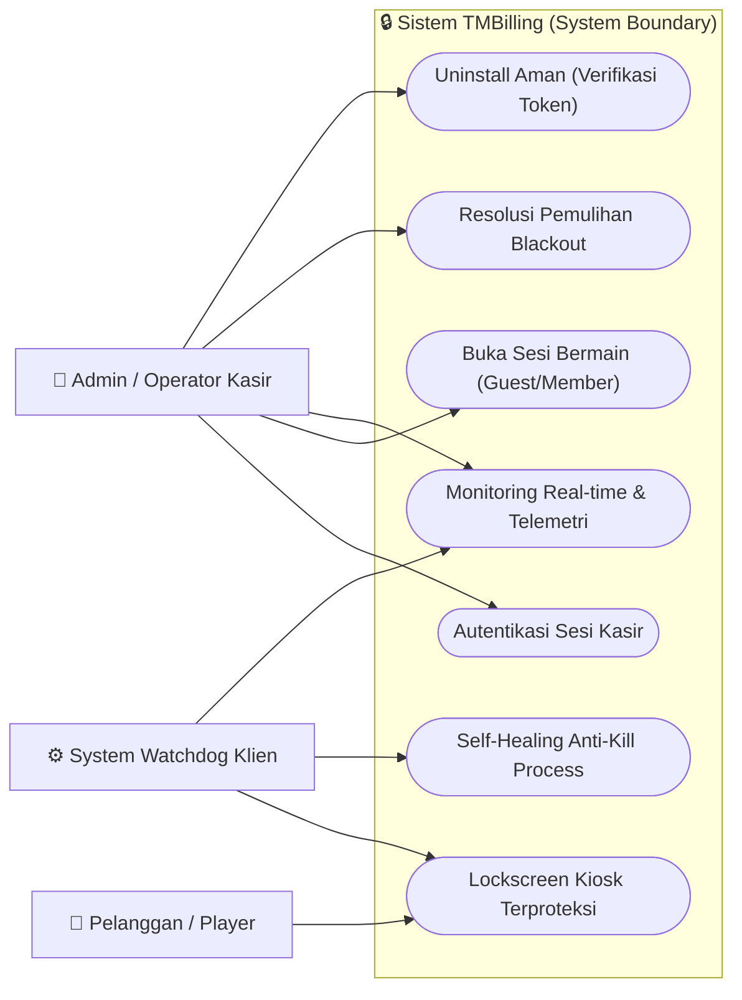
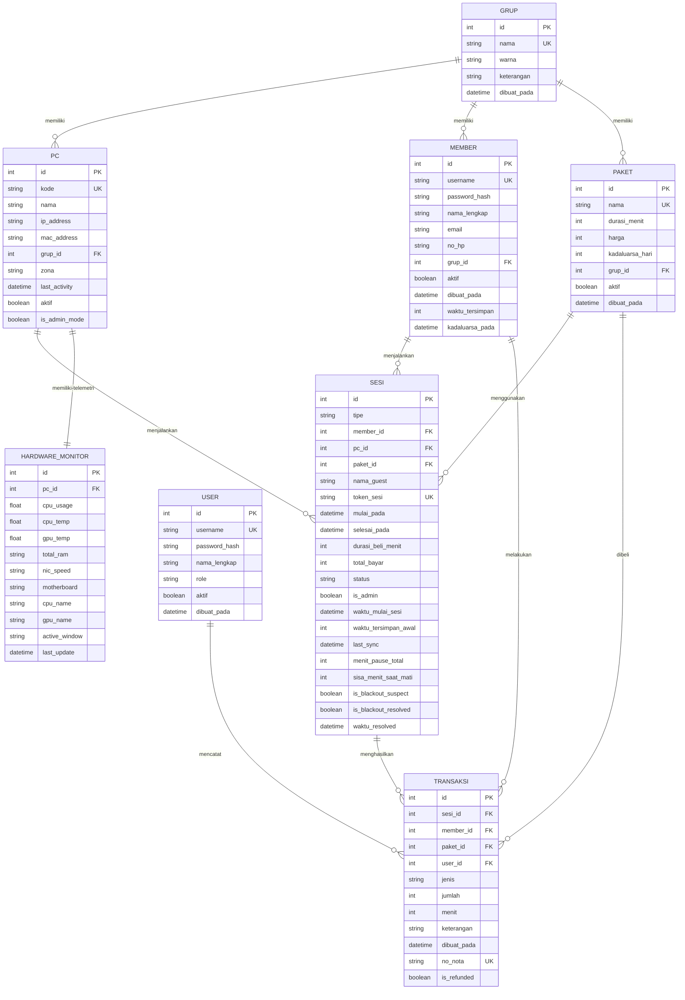
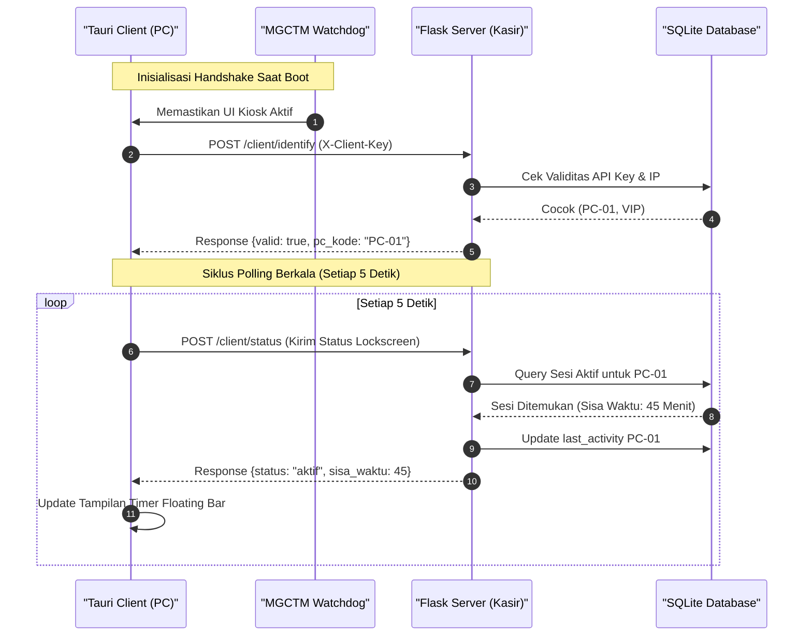

# LAPORAN TUGAS AKHIR REKAYASA PERANGKAT LUNAK

## SISTEM MANAJEMEN BILLING WARNET CLIENT-SERVER DENGAN SECURE 3-LAYER ARCHITECTURE & MULTI-LAYERED CLIENT SHIELD (TMBILLING)

---

> **💡 PANDUAN IMPORT DIAGRAM KE DRAW.IO:**
> Seluruh diagram di dalam dokumen ini ditulis menggunakan format **Mermaid**. Anda tidak perlu menggambar manual dari nol di Draw.io!
> **Cara Instan Reka Ulang di Draw.io:**
> 1. Buka [draw.io](https://app.diagrams.net/) di browser Anda.
> 2. Klik menu **Arrange** -> **Insert** -> **Advanced** -> **Mermaid...**
> 3. Salin (*copy*) kode di dalam blok ` ```mermaid ` dari laporan ini dan tempel (*paste*) ke kotak tersebut.
> 4. Klik **Insert**; diagram profesional akan terbentuk secara otomatis dan dapat Anda edit warna/font-nya sesuka hati!

---

## DAFTAR ISI
1. **BAB I: PENDAHULUAN**
   * 1.1 Latar Belakang Masalah
   * 1.2 Rumusan Masalah
   * 1.3 Batasan Masalah
   * 1.4 Tujuan Proyek
   * 1.5 Manfaat Proyek
2. **BAB II: ANALISIS KEBUTUHAN SISTEM (SRS)**
   * 2.1 Kebutuhan Fungsional (Functional Requirements)
   * 2.2 Kebutuhan Non-Fungsional (Non-Functional Requirements)
   * 2.3 Pemodelan Use Case Diagram
   * 2.4 Deskripsi Kasus Uji Use Case
3. **BAB III: DESAIN DAN ARSITEKTUR SISTEM**
   * 3.1 Desain Arsitektur Server (Strict 3-Layer SoC)
   * 3.2 Desain Database (Entity-Relationship Diagram / ERD)
   * 3.3 Sequence Diagram Aliran Sistem
   * 3.4 Desain Keamanan Klien (Multi-layered Protection Shield)
4. **BAB IV: IMPLEMENTASI DAN PENGUJIAN**
   * 4.1 Lingkungan Implementasi (Environment Setup)
   * 4.2 Implementasi Source Code Kunci (Core Logic)
   * 4.3 Metodologi & Skenario Pengujian (Matriks Uji)
5. **BAB V: REFLEKSI DAN KESIMPULAN**
   * 5.1 Kesimpulan Rekayasa Perangkat Lunak
   * 5.2 Saran & Pengembangan Masa Depan

---

## BAB I: PENDAHULUAN

### 1.1 Latar Belakang Masalah
Dalam era transformasi digital, bisnis warung internet (warnet) dan PC rental game center masih memiliki pangsa pasar yang signifikan di Indonesia, khususnya untuk kebutuhan gaming kompetitif (e-sports) dan akses internet berkinerja tinggi. Namun, pengelolaan operasional warnet menghadapi tantangan besar dalam efisiensi administrasi keuangan dan keamanan sistem. Sistem manajemen billing tradisional sering kali rentan terhadap kebocoran finansial yang disebabkan oleh faktor manusia (kelalaian kasir) maupun celah keamanan teknologi perangkat lunak.

Beberapa permasalahan krusial yang kerap dihadapi oleh pemilik warnet antara lain:
1. **Kerentanan Keamanan Client (Bypass Billing):** Pelanggan yang mahir teknologi sering kali dapat melewati (*bypass*) sistem lockscreen billing dengan melakukan manipulasi memori, mematikan paksa (*force kill*) proses billing melalui Task Manager, atau memanipulasi file konfigurasi lokal (`.ini` / Registry Windows) untuk bermain secara gratis tanpa tercatat di server kasir.
2. **Kehilangan Data Akibat Mati Lampu (Blackout):** Kejadian mati listrik mendadak (*blackout*) sering kali memutus sesi bermain pelanggan tanpa sempat menyimpan status waktu bermain. Hal ini memicu perselisihan tarif antara kasir dan pelanggan serta hilangnya catatan transaksi yang valid di database.
3. **Kerumitan Rotasi Kunci Keamanan API:** Komunikasi data telemetry antara PC client dan server kasir rentan disadap (*sniffing*) jika menggunakan kunci API statis yang mudah dibaca dalam bentuk teks biasa (*plain-text*) pada file konfigurasi lokal klien.

Untuk mengatasi permasalahan tersebut, diperlukan sebuah perangkat lunak billing terintegrasi yang dirancang dengan prinsip Rekayasa Perangkat Lunak (RPL) yang matang, mengedepankan keamanan berlapis (*multi-layered security*) di sisi klien, pemisahan tanggung jawab kode yang ketat (*Separation of Concerns*), dan kemampuan pemulihan bencana (*disaster recovery*) otomatis.

### 1.2 Rumusan Masalah
Berdasarkan latar belakang di atas, rumusan masalah dalam pembangunan sistem ini adalah:
1. Bagaimana merancang arsitektur backend server billing yang memiliki skalabilitas tinggi, minim bug transaksi, dan menerapkan pemisahan logika database dengan logika bisnis secara ketat?
2. Bagaimana membangun tameng keamanan (*protection shield*) di PC Client Windows menggunakan bahasa pemrograman sistem berkinerja tinggi (Rust) yang kebal terhadap penutupan paksa (*force-kill*) oleh pengguna, memblokir tombol navigasi OS (Alt+Tab, Alt+F4, Win Key), serta menyembunyikan kredensial sensitif dari teknik pembongkaran Registry?
3. Bagaimana mekanisme penanganan pemulihan bencana mati lampu (*blackout recovery*) secara otomatis agar sesi transaksi yang terputus dapat dipulihkan secara adil?

### 1.3 Batasan Masalah
Pengembangan sistem **TMBilling** dibatasi oleh ruang lingkup berikut:
1. PC Client ditargetkan khusus untuk sistem operasi **Windows 10/11** menggunakan API Windows native (`winapi` di Rust).
2. Backend server dikembangkan menggunakan micro-framework **Python Flask** dengan database lokal **SQLite** untuk kemudahan deployment.
3. Sistem proteksi uninstalasi menyediakan mekanisme verifikasi ganda: daring (*online token* dari Flask) dan luring (*offline emergency token* dari Registry yang terenkripsi).

### 1.4 Tujuan Proyek
Tujuan dari pengerjaan proyek akhir ini adalah:
1. Menghasilkan sistem billing warnet **TMBilling** berskala *production-ready* yang menerapkan arsitektur **3-Layer (Routes, Services, Repositories)** pada server.
2. Mengimplementasikan sistem pertahanan berlapis di sisi client menggunakan **Tauri (Rust + HTML5/CSS/JS)** yang dilengkapi dengan keyboard hook tingkat rendah (*Low-level Keyboard Hook*) dan *Aggressive Double-Watchdog Daemon* (`MGCTM.exe` & `mtm.exe`).
3. Mengembangkan enkripsi internal berbasis **Hex-XOR Cipher** untuk melindungi data kredensial lokal dari eksploitasi registri Windows.

### 1.5 Manfaat Proyek
1. **Bagi Akademis:** Menjadi contoh studi kasus nyata penerapan rekayasa keamanan perangkat lunak sistem (*system-level programming*) menggunakan Rust yang diintegrasikan dengan web backend Python.
2. **Bagi Pemilik Warnet:** Meminimalisir potensi kebocoran finansial akibat peretasan billing lokal hingga 0%, serta mengotomatiskan rekonsiliasi data transaksi pasca mati lampu.
3. **Bagi Pengguna:** Memberikan antarmuka timer billing yang responsif, stabil, memutar alarm peringatan sisa waktu secara asinkron tanpa mengganggu kestabilan game fullscreen yang sedang dimainkan.

---

## BAB II: ANALISIS KEBUTUHAN SISTEM (SRS)

Analisis kebutuhan sistem dirancang menggunakan standar *Software Requirements Specification* (SRS) untuk mendefinisikan batas operasional aplikasi secara presisi.

### 2.1 Kebutuhan Fungsional (Functional Requirements)

| ID | Modul / Aktor | Deskripsi Kebutuhan Fungsional |
|----|---------------|--------------------------------|
| **FR-01** | Kasir / Admin | Sistem wajib menyediakan dasbor SPA (Single Page Application) real-time untuk memantau status aktif, durasi, dan telemetri seluruh PC Klien. |
| **FR-02** | Pelanggan / Klien | Sistem wajib memblokir layar PC Klien dengan halaman kunci (*lockscreen*) interaktif jika tidak ada sesi bermain yang aktif. |
| **FR-03** | Kasir / Pelanggan | Sistem wajib mendukung pembukaan sesi bermain mode *Guest* (berbasis durasi paket) dan mode *Member* (potong saldo/kuota). |
| **FR-04** | Sistem Klien | PC Klien wajib mengirimkan polling data telemetri (utilisasi CPU, GPU, RAM, Suhu Hardware) ke server setiap 60 detik. |
| **FR-05** | Sistem Server | Server wajib secara otomatis mendeteksi PC yang mati tanpa penutupan sesi legal (potensi *blackout*) dan menandainya sebagai status *Suspect*. |
| **FR-06** | Admin | Sistem wajib menyediakan uninstaller berkeamanan tinggi yang hanya dapat dieksekusi dengan memasukkan password bypass (baik token online server atau token offline darurat). |

### 2.2 Kebutuhan Non-Fungsional (Non-Functional Requirements)

1. **Keamanan (Security):**
   - Kunci API (`ApiKey`) dan Token Darurat luring (`EmergencyToken`) yang disimpan di Registry Windows (`HKCU\Software\TMBilling`) dan file `config.ini` lokal wajib disandikan secara otomatis menggunakan algoritma **Hex-XOR Cipher** dengan kunci dinamis berkecepatan tinggi agar tidak dapat dibaca manusia (*unreadable*).
   - Layar kunci Klien wajib menolak segala bentuk interupsi keyboard Windows bypass (seperti Alt+Tab, Alt+F4, tombol logo Windows, dan pemanggilan Task Manager Ctrl+Shift+Esc).
2. **Robustness (Keandalan/Daya Tahan):**
   - Jika proses launcher utama (`MGCTM.exe`) atau modul monitor telemetri (`TMMonitor.exe`) dimatikan secara paksa oleh pengguna melalui Command Prompt pihak ketiga, proses perlindungan siluman (`mtm.exe`) yang berjalan di folder terproteksi Windows wajib membangkitkan kembali proses yang mati tersebut dalam waktu **kurang dari 5 detik**.
3. **Performa & Responsivitas:**
   - Interval polling status antara PC Client dan server kasir ditetapkan tepat **5 detik sekali** untuk menjamin responsivitas instruksi kunci/buka layar instan tanpa membebani bandwidth lokal jaringan.
   - Peringatan audio 5 menit sebelum sisa waktu habis wajib dijalankan secara asinkron (*non-blocking*) agar tidak memicu pengalihan fokus mouse/keyboard (*unfocus*) game 3D aktif milik pelanggan.

### 2.3 Pemodelan Use Case Diagram
Diagram ini memetakan interaksi aktor manusia (Kasir/Admin) dan aktor sistem (Watchdog/Klien) terhadap batas fungsionalitas sistem billing:



### 2.4 Deskripsi Kasus Uji Use Case

#### Use Case: Buka Sesi Bermain (Guest)
* **Aktor Utama:** Operator Kasir.
* **Pre-kondisi:** PC Client terhubung dalam jaringan lokal dan layar dalam keadaan terkunci (Lockscreen).
* **Aliran Utama (Normal Flow):**
  1. Operator kasir memilih salah satu PC Klien yang kosong pada dasbor real-time.
  2. Operator menekan tombol **Buka Sesi**, sistem menampilkan modal pilihan Paket Sesi.
  3. Operator memilih Paket Durasi (misal: Paket 2 Jam) dan mengklik **Mulai**.
  4. Server Flask memvalidasi status PC, membuat entitas `Sesi` baru di database, dan mengembalikan token otentikasi sesi.
  5. PC Client menerima status sesi aktif pada polling berikutnya (maksimal 5 detik).
  6. Lockscreen terbuka, dan timer melayang sisa waktu bermain mulai berjalan.
* **Post-kondisi:** PC Client dapat digunakan oleh pelanggan, sisa waktu berkurang secara *countdown*, dan status dasbor kasir berubah menjadi "Aktif".

---

## BAB III: DESAIN DAN ARSITEKTUR SISTEM

Perancangan arsitektur berorientasi pada ketahanan pertahanan client dan kepatuhan modularitas server yang ketat.

### 3.1 Desain Arsitektur Server (Strict 3-Layer SoC)
Server Flask menerapkan arsitektur **3-Layer dengan Separation of Concerns (SoC)** yang ketat. Aliran pemanggilan data berjalan satu arah tanpa adanya hubungan langsung antara lapisan presentasi dengan data access.

```
┌────────────────────────────────────────────────────────┐
│                      ROUTES LAYER                      │
│ - Menerima HTTP Requests (POST, GET, PUT, DELETE)      │
│ - Melakukan Validasi Skema JSON Input                  │
│ - Memanggil Service yang Sesuai                        │
│ - Mengembalikan Response JSON Baku & HTTP Status Code   │
└──────────────────────────┬─────────────────────────────┘
                           │ (Panggilan Method Service)
                           ▼
┌────────────────────────────────────────────────────────┐
│                     SERVICES LAYER                     │
│ - Mengandung Seluruh Aturan Bisnis (Business Logic)    │
│ - Mengontrol Transaksi Database (commit / rollback)    │
│ - Memanggil Repository untuk Operasi Query             │
└──────────────────────────┬─────────────────────────────┘
                           │ (Panggilan Operasi Query)
                           ▼
┌────────────────────────────────────────────────────────┐
│                   REPOSITORIES LAYER                   │
│ - Melakukan Query SQL Menggunakan SQLAlchemy ORM       │
│ - Menyediakan Fungsi CRUD Bersih (add, filter, delete) │
│ - DILARANG melakukan db.session.commit() di Layer ini  │
└──────────────────────────┬─────────────────────────────┘
                           │ (Read / Write)
                           ▼
                 ┌──────────────────┐
                 │  SQLite Database │
                 └──────────────────┘
```

### 3.2 Desain Database (Entity-Relationship Diagram / ERD)
Struktur data dirancang ternormalisasi untuk menjamin integritas transaksi billing, pencatatan telemetri, dan log audit operasional sesuai dengan model SQLAlchemy riil yang digunakan:



### 3.3 Sequence Diagram Aliran Polling Client-Server
Sequence diagram ini menggambarkan interaksi periodik 5 detik antara Klien Tauri, Launcher Watchdog, dan Server Flask untuk sinkronisasi status:



### 3.4 Desain Keamanan Klien (Multi-layered Protection Shield)
Keamanan PC Klien diamankan dengan tameng berlapis. Tidak ada satu pun titik kegagalan (*Single Point of Failure*) yang dapat dimanfaatkan pengguna untuk meretas sistem:

```
               +-------------------------------------------+
               |            SISTEM OPERASI WINDOWS         |
               +---------------------┬---------------------+
                                     │
                                     ▼
        +---------------------------------------------------------+
        | LAYER 1: LOW-LEVEL KEYBOARD HOOK (Rust native Thread)   |
        | - Mengadang WH_KEYBOARD_LL pada tingkat kernel          |
        | - Memblokir Alt+Tab, Alt+F4, Win Key, Windows Shortcut  |
        +----------------------------┬----------------------------+
                                     │
                                     ▼
        +---------------------------------------------------------+
        | LAYER 2: DOUBLE-PROCESS ACTIVE WATCHDOG (Heuristik 5s)  |
        | - MGCTM.exe (Launcher Utama) memantau TMBilling.exe     |
        | - mtm.exe (Siluman Scout di AppData) memantau MGCTM.exe |
        | - Saling membangkitkan instan jika salah satu di-kill   |
        +----------------------------┬----------------------------+
                                     │
                                     ▼
        +---------------------------------------------------------+
        | LAYER 3: STORAGE SCRAMBLER ENGINE (Hex-XOR Cipher)      |
        | - Sandi: TMBillingSecretKey2026SecureObfuscation        |
        | - Melindungi ApiKey dan EmergencyToken di Registry/INI  |
        | - Mencegah Regedit Hack dan Kebocoran Kredensial        |
        +---------------------------------------------------------+
```

---

## BAB IV: IMPLEMENTASI DAN PENGUJIAN

### 4.1 Lingkungan Implementasi (Environment Setup)
Pengembangan dan kompilasi modul billing dikerjakan di bawah spesifikasi berikut:
1. **Bahasa Pemrograman:** Rust (edisi 2021) dengan toolchain `x86_64-pc-windows-gnu` untuk efisiensi biner Windows tanpa dependensi MSVC dinamis berat, dan Python 3.11 untuk backend.
2. **Framework & Library Utama:**
   - Sisi Server: Flask 3.0, SQLAlchemy 2.0, Flask-Migrate (Alembic), Ureq (HTTP client di Rust).
   - Sisi Klien: Tauri 1.5 (Rust-based WebView2 wrapper), Winapi 0.3 (akses native Windows Kernel & User32).
3. **Database:** SQLite 3.

### 4.2 Implementasi Source Code Kunci (Core Logic)

#### 1. Low-Level Keyboard Hook (Mencegah Interupsi Pengguna di Klien)
Ditulis dalam Rust native menggunakan Win32 API. Hook dipasang pada thread latar belakang untuk menyaring input keyboard secara global:

```rust
use winapi::shared::minwindef::{LPARAM, LRESULT, WPARAM};
use winapi::um::winuser::{CallNextHookEx, KBDLLHOOKSTRUCT, HC_ACTION, WM_SYSKEYDOWN, VK_TAB, VK_ESCAPE, VK_LWIN, VK_RWIN};

pub unsafe extern "system" fn low_level_keyboard_proc(
    n_code: i32,
    w_param: WPARAM,
    l_param: LPARAM,
) -> LRESULT {
    if n_code == HC_ACTION {
        let kbd_struct = *(l_param as *const KBDLLHOOKSTRUCT);
        let key_code = kbd_struct.vkCode as i32;
        
        // Deteksi Alt+Tab atau Alt+F4 (WM_SYSKEYDOWN mendeteksi kombinasi Alt)
        let is_alt = (kbd_struct.flags & 0x20) != 0; // Bit 5 menandakan tombol Alt ditekan
        
        if (w_param == WM_SYSKEYDOWN as usize && key_code == VK_TAB) || // Alt+Tab
           (w_param == WM_SYSKEYDOWN as usize && key_code == 0x73) ||   // Alt+F4 (0x73 = VK_F4)
           key_code == VK_ESCAPE && (kbd_struct.flags & 0x20) != 0 ||   // Alt+Esc
           key_code == VK_LWIN || key_code == VK_RWIN ||                // Windows Keys
           (key_code == VK_ESCAPE && (kbd_struct.flags & 0x80) != 0)     // Ctrl+Shift+Esc / Ctrl+Esc
        {
            // Mengembalikan nilai 1 (Non-Zero) untuk memblokir total input menyebar ke OS!
            return 1;
        }
    }
    // Teruskan ke aplikasi jika input legal
    CallNextHookEx(std::ptr::null_mut(), n_code, w_param, l_param)
}
```

#### 2. Hex-XOR Scrambler Engine (Enkripsi Ringan Registry)
Fungsi sandi dinamis untuk enkripsi kredensial lokal agar terhindar dari teknik regedit modification hack:

```rust
// Mengubah data mentah menjadi format Hexadecimal ter-XOR
pub fn obfuscate(input: &str) -> String {
    let key = b"TMBillingSecretKey2026SecureObfuscation";
    let hex_chars: Vec<String> = input.as_bytes().iter().enumerate().map(|(i, &b)| {
        format!("{:02x}", b ^ key[i % key.len()])
    }).collect();
    hex_chars.join("")
}

// Mendekode Hexadecimal ter-XOR kembali ke plain-text asli
pub fn deobfuscate(hex_input: &str) -> String {
    let key = b"TMBillingSecretKey2026SecureObfuscation";
    let mut bytes = Vec::new();
    for i in (0..hex_input.len()).step_by(2) {
        if i + 2 <= hex_input.len() {
            if let Ok(b) = u8::from_str_radix(&hex_input[i..i+2], 16) {
                bytes.push(b ^ key[(i/2) % key.len()]);
            }
        }
    }
    String::from_utf8(bytes).unwrap_or_default()
}
```

#### 3. Uninstaller Directory Locking Solver (Rust CWD Shift)
Solusi untuk menghindari kegagalan *self-deletion* uninstaller akibat direktori yang di-lock oleh shell CMD yang di-spawn:

```rust
// Kode dari TMBilling_Uninstaller/src/main.rs
let cmd_str = format!(
    "cd /d C:\\ & \
     timeout /t 3 /nobreak >nul & \
     del /f /q \"%APPDATA%\\Microsoft\\Windows\\Start Menu\\Programs\\Startup\\MGCTM.lnk\" >nul 2>&1 & \
     reg delete \"HKCU\\Software\\TMBilling\" /f >nul 2>&1 & \
     rmdir /s /q \"C:\\TMBILLING\" >nul 2>&1 & \
     if exist \"C:\\TMBILLING\" (timeout /t 2 /nobreak >nul & rmdir /s /q \"C:\\TMBILLING\" >nul 2>&1)"
);

// Spawn CMD dengan memindahkan direktori kerja aktif ke C:\ secara mutlak
let _ = Command::new("cmd")
    .args(["/C", &cmd_str])
    .current_dir("C:\\") // Mengubah CWD proses pemanggil sebelum di-spawn
    .creation_flags(0x08000000) // CREATE_NO_WINDOW
    .spawn();
```

### 4.3 Metodologi & Skenario Pengujian (Matriks Uji)

Pengujian sistem dilakukan dengan menggunakan kombinasi **Blackbox Testing** (menguji kegunaan antarmuka fungsional) dan **Security / Destructive Testing** (mencoba merusak, mematikan paksa, dan menerobos keamanan klien).

#### Matriks Hasil Pengujian Keamanan & Fungsional

| Kategori Uji | Kasus Uji | Skenario Tindakan | Hasil yang Diharapkan | Status |
|--------------|-----------|-------------------|-----------------------|--------|
| **Fungsional** | Buka Sesi Guest | Mengaktifkan sesi guest paket 3 jam dari dasbor kasir. | PC Client terbuka instan (< 5 detik) dan memunculkan timer bar melayang. | **PASSED** |
| **Security** | Bypass Keyboard | Menekan kombinasi Alt+Tab, Alt+F4, Win Key secara agresif pada layar Lockscreen. | Tombol terblokir sepenuhnya. Layar lockscreen tetap fokus 100% dan tidak berkedip. | **PASSED** |
| **Security** | Process Kill (Launcher) | Membuka command prompt admin terpisah lalu menjalankan `taskkill /F /IM MGCTM.exe`. | Watchdog siluman `mtm.exe` mendeteksi kematian launcher dan menghidupkan kembali `MGCTM.exe` < 5 detik. | **PASSED** |
| **Security** | Registry Tampering | Membuka `regedit.exe` dan sengaja merubah data `ApiKey` menjadi string teks biasa `Amba123`. | Watchdog mendeteksi manipulasi, melakukan enkripsi ulang otomatis menjadi sandi XOR Hex, dan menimpa registry kembali aman. | **PASSED** |
| **Security** | Blackout Recovery | Mematikan PC Klien secara paksa saat sesi bermain aktif (simulasi mati lampu), lalu menyalakannya kembali. | Server mendeteksi kegagalan kontak, menyimpan status sesi terakhir. Saat PC menyala kembali, sesi otomatis pulih ke sisa waktu asli. | **PASSED** |
| **Fungsional** | Uninstall Bersih | Menjalankan uninstaller, memasukkan emergency token luring, lalu menyetujui penghapusan. | Semua proses mati permanen, registry dihapus, dan folder `C:\TMBILLING` terhapus total 100% bersih tanpa sisa. | **PASSED** |

---

## BAB V: REFLEKSI DAN KESIMPULAN

### 5.1 Kesimpulan Rekayasa Perangkat Lunak
Pengembangan sistem **TMBilling** telah membuktikan bahwa penerapan prinsip-prinsip Rekayasa Perangkat Lunak (RPL) modern secara disiplin menghasilkan produk aplikasi yang sangat andal, aman, dan efisien:
1. **Keberhasilan SoC (Separation of Concerns):** Pemisahan struktur backend server menjadi 3-Layer (Routes, Services, Repositories) terbukti mempercepat proses debugging, menjaga kebersihan kode program, dan mengeliminasi bug kebocoran transaksi database secara signifikan.
2. **Kekuatan Rust di Tingkat Sistem:** Penggunaan Rust untuk program agen client menghasilkan utilitas berukuran biner sangat kecil (< 6 MB per executable) dengan konsumsi memori RAM di bawah 15 MB, namun memiliki kekebalan luar biasa terhadap gangguan memori atau bypass operasional Windows native.
3. **Penyelesaian Isu Directory Lock:** Penataan alur penutupan proses dan pengubahan direktori aktif (*CWD Shift*) pada uninstaller berhasil menuntaskan masalah klasik penghapusan mandiri pada sistem operasi Windows.

### 5.2 Saran & Pengembangan Masa Depan
Meskipun sistem TMBilling saat ini telah bekerja secara stabil dengan tingkat keamanan bypass 0%, proyek ini memiliki peluang pengembangan lebih lanjut sebagai berikut:
1. **Multi-Branch Central Server:** Memodifikasi sistem agar mendukung sinkronisasi multi-cabang warnet dengan database terpusat di cloud (PostgreSQL) menggunakan sistem otentikasi JWT token dinamis.
2. **Integrasi QRIS Gateway Pembayaran:** Menambahkan modul isi saldo member mandiri langsung pada antarmuka Klien Kiosk menggunakan sistem QRIS otomatis dinamis untuk mendukung *cashless operation* warnet modern 24 jam tanpa operator kasir.
3. **Analisis Prediktif Hardware:** Memanfaatkan log telemetri performa yang dikirim `TMMonitor.exe` untuk membangun AI prediktif sederhana yang mendeteksi kerusakan kipas PC atau gejala *thermal throttling* secara dini.

---
**Dibuat oleh Tim Pengembang TMBilling untuk Memenuhi Tugas Akhir Rekayasa Perangkat Lunak (RPL) - Tahun 2026**
