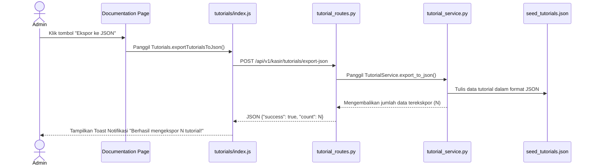

# Design Spec: Integrasi Fitur Ekspor Tutorial ke JSON di UI Admin

**Tanggal**: 2026-08-12  
**Status**: Draft / Awaiting Approval  
**Sistem**: TMBilling Documentation Module (UI, JS, Backend)

---

## 1. Ikhtisar Masalah & Solusi Desain

### A. Masalah: Kemudahan Alur Ekspor bagi Developer
- **Problem**: Menjalankan script Python CLI secara manual di terminal bisa merepotkan dan rentan kesalahan path bagi developer/pengembang yang sedang menyunting panduan via CKEditor.
- **Tujuan**: Mengintegrasikan tombol aksi ekspor langsung di halaman **Dokumentasi & Panduan** UI TMBilling khusus untuk pengguna dengan hak akses **Admin**.

### B. Solusi: UI Button & REST API Endpoint
1. **Frontend Button**:
   - Tambahkan tombol **"📥 Ekspor ke JSON"** di samping tombol "Tambah Panduan Baru" pada header [`documentation.html`](file:///c:/Project%20GIT/TMBilling/app/templates/kasir/documentation.html).
   - Tombol ini hanya dirender jika role user adalah `admin`.
2. **Frontend JS Action**:
   - Tulis `exportTutorialsToJson()` di [`index.js`](file:///c:/Project%20GIT/TMBilling/app/static/js/kasir/modules/tutorials/index.js) untuk mengirimkan request `POST /api/v1/kasir/tutorials/export-json` dan menampilkan toast notifikasi jika sukses/gagal.
3. **Backend Route**:
   - Tambahkan rute `/export-json` di [`tutorial_routes.py`](file:///c:/Project%20GIT/TMBilling/app/routes/tutorial/tutorial_routes.py) dengan decorator `@admin_required`.
4. **Service Handler**:
   - Tambahkan method `export_to_json()` di `TutorialService` yang bertugas melakukan query database dan menulis output ke `app/data/seed_tutorials.json`.
5. **Pembersihan Root**:
   - Hapus script sementara `export_tutorials.py` di root direktori agar bersih.

---

## 2. Alur Interaksi UI

---

## 3. Rencana Verifikasi

1. **Uji Tampilan UI**:
   - Pastikan tombol **"📥 Ekspor ke JSON"** tampil saat login sebagai Admin di halaman `/kasir/documentation`.
   - Pastikan tombol TIDAK tampil saat login sebagai kasir biasa.
2. **Uji Klik Ekspor**:
   - Klik tombol ekspor, verifikasi toast sukses muncul.
   - Periksa file `app/data/seed_tutorials.json` ter-update dengan benar di filesystem.
3. **Uji Keamanan**:
   - Pastikan endpoint `/export-json` tidak dapat diakses tanpa hak akses Admin.
